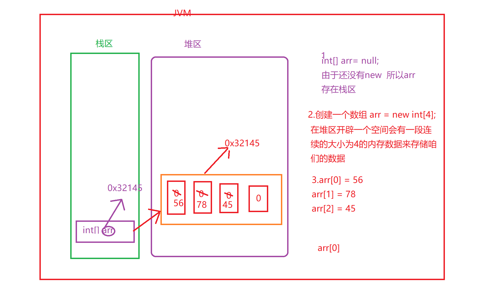

``` java 
1.安装jdk和环境变量的配置
	详细的文档
2.使用eclipse编写一个Java工程
	
在一个包下面右键 -》new ->class
Demo1
class Demo1 {
	public static void main (String [] args) {//固定的
		System.out.println("狗蛋");
	}

}
点击运行按钮 运行代码   狗蛋
4.声明变量的语法格式
	数据类型  变量名字 = 值;
	int a = 30;//将30赋值给变量a
5.数据类型
	八大基本数据类型: byte  short  int  long  double float  char boolean
		通过八大基本数据声明变量：
			byte  b1 = 98;
			short s1 = 78;
			int i1 = 99;
			long l1 = 18929299292929L;
			
			float f1 = 56.4f;
			double d1 = 2892.98;//Java默认就是double类型的数据
			
			char ch1 = '中';//单引号中只能放一个元素
			boolean b2 = true; 
			
	引用数据类型:String
			String str = "大漠孤烟直";
			
	
6.运算符
	1.算术运算符
		+  -   *  /  %
		int a = 3 + 4;//把3+4这个表达式的结果赋值给 变量a
		int b = 7 / 2;//  商    3
		int c = 7 % 2;//  1
		
		+=  -=  *= /=    %=
		int num1 = 20;
		num1 = num1 + 10;
		简写   num1 += 10;
		//先看=右边的  num1 + 10===> 30
		//将30赋值给=左边的
		sout(num1);//30
		自增和自减
		num1++：先执行当前的操作，然后自身加1  sout(num1++)===>30  sout(num1)==>31
		++1num：先自身加1 ，然后再执行其他操作  sout(++num1)===>32 sout(num1)===>32
	2.关系运算符
		>   <  >=  <=  ==   !=
		boolean ret = 4 > 3;
		boolean ret1 = 5 == 5;
		
	3.逻辑运算符
		是由多个关系运算符组成 咋连接靠  &&  ||  ！
		boolean ret = 4 > 3 && 5 > 8;   &&  关系运算符全部是true的时候 才为true。
		只有有一个false就为false   生活中  且
		
		boolean ret1 = 6> 9 || 9 > 1;  ||  关系运算符全部为false的时候 才为false
		只要有一个为true的话就为true 生活中的 或
		
		boolean ret2 = !4 > 5;// true
		
	4.逻辑短路原则
		逻辑与的短路原则:   多个关系表达式 只要有一个为false的话，后面的关系表达式就不再执行
		逻辑或的短路原则:  多个关系表达式 只要有一个为true的话 ,后面的二关系表达式就不再执行了
		
	5.分支结构
		if分支
		if (布尔表达式) {
			语句体
		}
		if (4 > 2) {
			System.out.println("狗蛋");
		}
		if-esle 分支
		if (布尔表达式) {
			语句体1
		} else {
			语句体2
		}
		if (user == 222 && password = 111) {
			System.out.println("用户名密码正确");
		} else {
			System.out.println("用户名密码不正确");
		}
		
		if- else if  分支
            int score = 90;
		if (score <=100 && score >= 90) {
			sout("优秀")
		} else if () {
            
        } else if () {
            
        } else {
            
        }
	
	6.循环
       while () {
           
       }
 		do-while () {
            
        }
		for(表达式1; 表达式2; 表达式3) {
            循环体
        }
		执行流程:   表达式 1，然后再执行表达式2 看表达式2De值是true还是false
            如果是true，就执行大括号中的代码。执行表达式3
            再次回到表达式2，直到表达式2为false即可 循环结束
		循环做什么事情:  做重复的事情和有规律的事情
    7.方法的声明
            
```

作业

```
1.写一个方法，判断一个字符是否是数字字符
2.写一个方法，判断一个字符是否是英文字符（包含大写和小写）
3.写一个方法， 将一个整数逆序打印
	int a = 1234;
	打印
	4
	3 
	2
	1
4.写一个方法判断一个数是否是正数
```

```java 
package com.qf.a_test;

import java.util.Scanner;

public class Demo1 {
	public static void main(String[] args) {
		isNumberChar();
	}

	// 无参无返回值的方法
	public static void isNumberChar() {
		// 写一个方法，判断一个字符是否是数字字符
		Scanner scanner = new Scanner(System.in);
		System.out.println("请输入一个字符:");
		char ch1 = scanner.next().charAt(0);
		if (ch1 >= '0' && ch1 <= '9') {
			System.out.println("是一个数字字符");
		} else {
			System.out.println("不是一个数字字符");
		}
	}
}

```

```java 
package com.qf.a_test;

import java.util.Scanner;

public class Demo2 {
	public static void main(String[] args) {
		
		Scanner scanner =  new Scanner(System.in);
		System.out.println("请输入一个字符:");
		char ch1 = scanner.next().charAt(0);
		isNumberChar(ch1);//ch1 实参
	}
	//有参无返回值的方法
	public static void isNumberChar (char ch1) {//ch1 形参
		if (ch1 >= '0' && ch1 <= '9') {
			System.out.println("是数字字符");
		} else {
			System.out.println("不是数字字符");
		}
	}
}

```

```java 
package com.qf.a_test;

import java.util.Scanner;

public class Demo3 {
	public static void main(String[] args) {
		String string = isNumberChar();
		System.out.println(string);
		System.out.println(isNumberChar());
//		int a = 30;
//		System.out.println(a);
//		System.out.println(30);
	}
	//无参有返回值的方法
	public static  String isNumberChar () {
		Scanner scanner = new Scanner(System.in);
		System.out.println("请输入一个字符:");
		char ch1 = scanner.next().charAt(0);
		if (ch1 >= '0' && ch1 <= '9') {
			return "是一个数字字符";
		} 
		return "不是数字字符";
		
		
	}
}

```

```java 
package com.qf.a_test;

import java.util.Scanner;

public class Demo4 {
	public static void main(String[] args) {
		Scanner scanner = new Scanner(System.in);
		System.out.println("请输入一个字符:");
		char ch1 = scanner.next().charAt(0);
		System.out.println(isNumberCharString(ch1));
	}
	//有参有返回值的方法
	public static String isNumberCharString (char ch1) {
		if (ch1 >= '0' && ch1 <= '9') {
			 return "是数字字符";
		} else {
			return "不是数字字符";
		}
	}
}

```

```java 
package com.qf.a_test;

import java.util.Scanner;

public class Demo5 {
	public static void main(String[] args) {
		isEnglish();
	}

	// 无参无返回值的方法
	public static void isEnglish() {
		// 写一个方法，判断一个字符是否是数字字符
		Scanner scanner = new Scanner(System.in);
		System.out.println("请输入一个字符:");
		char ch1 = scanner.next().charAt(0);
		if ((ch1 >= 'A' && ch1 <= 'Z') || (ch1 >= 'a' && ch1 <= 'z')) {
			System.out.println("是一个英文字符");
		} else {
			System.out.println("不是一个英文字符");
		}
	}
}

```

```java 
package com.qf.a_test;

public class Demo6 {
	public static void main(String[] args) {
		printReverse();
	}
	public  static void printReverse () {
		int a = 1235892;
		/**
		 * 12345 % 10 = 5     12345 / 10 = 1234
		 * 1234 % 10 = 4      1234 /10 = 123
		 * 123 % 10 = 3       123 / 10 = 12
		 * 12 % 10 = 2        12 /10 =1
		 * 1 %10 = 1          1/10 = 0  
		 * 循环三个条件:
		 * 	1.初始话条件   int  a = 12345;
		 * 	2.循环条件   a = a/ 10     
		 * 	3.终止条件  a != 0
		 */
		while (a != 0) {
			System.out.println(a % 10);
			//a = a / 10;
			a /= 10;
		}
	}
}

```

### 今天的内容

> 数组

### 1.开发中会有数组

> 开发中如果出现了大量的同一个类型的数据。如果按照现在所学的知识点
>
> int a = 30;
>
> int b = 40;
>
> int c = 50;
>
> 。。。。
>
> 这样的话，变量会有很多个。相当麻烦
>
> 使用数组:只需要声明一个变量就可以存好多的数据。
>
> int[] a = {1,2 , 3, 4, 5};

### 2.数组在Java中如何定义

> 变量:
>
> ​		int  a = 20;
>
> ​		数据类型  变量名字  =  值;
>
> 数组定义的语法格式:
>
> 第一种:
>
> ```
> 数据类型[]  变量名字 =  {值1, 值2, 值3, ...};
> ```
>
> 或者
>
> ```
> 数据类型 变量名字[] =  {值1, 值2, 值3, ...};
> ```
>
> ```Java
> package com.qf.a_test;
> 
> import java.util.Arrays;
> 
> public class Demo7 {
> 	public static void main(String[] args) {
> 		//声明一个数组类型的数据
> 		String[] strs = {"狗蛋", "张三", "李四", "王五"};
> 		System.out.println(strs);//[Ljava.lang.String;@15db9742 
> 		//关于String数组打印的是内存地址 好不好？  不好 咋办？
> 		//toString 将内存地址（看不懂）转为字符串（能看懂 对程序有友好）
> 		System.out.println(Arrays.toString(strs));//[狗蛋, 张三, 李四, 王五]
> 	
> 		
> 		int[] arr= {1, 2,3 , 4, 5};
> 		System.out.println(arr);//[I@6d06d69c
> 		System.out.println(Arrays.toString(arr));//[1, 2, 3, 4, 5]
> 		
> 		//除了char数组其他的都是需要toString 才能看到数据的
> 		
> 		char[] chs = {'a', 'b', 'c'};
> 		System.out.println(chs);//abc
> 		
> 	}
> }
> 
> ```
>
> 第二种声明方式:
>
> ```
> 数据类型[] 变量 = new 数据类型[容量];
> ```
>
> ```Java
> package com.qf.a_test;
> 
> import java.util.Arrays;
> 
> public class Demo8 {
> 	public static void main(String[] args) {
> 		//第二种声明方式   先声明空的数组然后再赋值
> 		int[] arr = new int[3];//声明了一个空的数组[0,0,0]
> 		System.out.println(Arrays.toString(arr));//[0, 0, 0]
> 		//添加数据，咋添加？ 通过下标进行添加
> 		//[0, 0, 0]
> 		// 0  1  2  下标一定是有顺序
> 		arr[0] = 89;//将89赋值给下标为 0位置的数据 [89, 0,0]
> 		System.out.println(Arrays.toString(arr));
> 		arr[1] = 76;
> 		System.out.println(Arrays.toString(arr));
> 		arr[2] = 26;
> 		System.out.println(Arrays.toString(arr));//[89, 76, 26]
> 		//arr[3] = 89;//ava.lang.ArrayIndexOutOfBoundsException: 3
> 		
> 	}
> }
> 
> ```
>
> 第三种：
>
> ```
> 数据类型[] 变量 = new 数据类型[]{值1, 值2, 值3,....};
> ```
>
> ```java 
> //第三种方式
> 		int[] arr1 = new int[] {8, 7, 6, 5};
> 		System.out.println(Arrays.toString(arr1));
> ```
>

总结一下

```
1.
int[]  arr = {2, 8, 9, 67};//声明并赋值
2.
int[] arr1 = new int[4];//声明了空的数组  [0,0,0,0]
赋值 通过下标来进行赋值
arr1[0]  = 78;//将78赋值 arr1这个数组的第一个数  [78,0,0,0]

3.
int[] arr2 = new int[] {1,2,3,45};//声明并赋值
```

### 3.第二种方式创建数组进行赋值

```Java
package com.qf.a_test;

import java.util.Arrays;

public class Demo9 {
	public static void main(String[] args) {
		int[] arr = new int[3];
		//以下是在赋值
		arr[0] = 67;
		arr[1] = 78;
		arr[2] = 12;
		//arr[3] = 89;//ArrayIndexOutOfBoundsException
		System.out.println(arr);//内存地址
		System.out.println(Arrays.toString(arr));//[67, 78, 12]
	}
}

```

### 4.把数组中的数据取出来

```Java
package com.qf.a_test;

public class Demo10 {
	public static void main(String[] args) {
		int[] arr = {32, 45, 58};
		//取值，通过下标进行取值的
		System.out.println(arr[0]);
		System.out.println(arr[1]);
		System.out.println(arr[2]);
		//System.out.println(arr[3]);
		System.out.println("=====");
		//遍历   
		for (int i = 0; i < 3; i++) {
			System.out.println(arr[i]);
		}
		//arr.length  数组的长度
		System.out.println(arr.length);//5
		System.out.println("----------");
		//再次遍历
		for (int i = 0; i < arr.length; i++) {
			System.out.println(arr[i]);
		}
		
		System.out.println("****************");
		String[] strs = {"张三", "李四", "王五", "老六"};
		for (int i = 0; i < strs.length; i++) {
			System.out.println(strs[i]);
		}
	}
}

```

### 5.数组可以作为方法的参数

> 方法的参数可以是哪些数据类型？
>
> 八大基本数据类型   ，String
>
> 数组也可以作为方法的参数的
>
> ```Java
> public  static void test (int[] a) {
>     
> }
> ```
>
> 

```java 
package com.qf.a_test;

public class Demo11 {
	public static void main(String[] args) {
		int[] sbs = {12,3,4,5};
		int[] arr = {1,9,12,89};
		printArr(sbs,arr);//arr 实参
	}
	public static void  printArr (int[] arr, int[] arr1) {//arr 是数组的变量 形参
		for (int i = 0; i < arr.length; i++) {
			System.out.println(arr[i]);
		}
		for (int i = 0; i < arr1.length; i++) {
			System.out.println(arr1[i]);
		}
	}
}

```

```java 
package com.qf.a_test;

import java.util.Arrays;

public class Demo12 {
	public static void main(String[] args) {
		int[] arr = new int[6];//[0,0,0,0,0,0]
		setArr(arr);//对空的数组进行赋值
		System.out.println(Arrays.toString(arr));//[34, 35, 36, 37, 38, 39]
	}
	public static void setArr (int[] arr) {
		//对arr进行赋值
		for (int i = 0; i < arr.length; i++) {
			arr[i] = 34 + i;
		}
	}
}

```

### 6.数组可以作为方法的返回值

> 之前学的方法的返回值 类型
>
> 八大基本数据类型 + String
>
> 数组也是可以作为方法的返回值的

```Java
package com.qf.a_test;

import java.util.Arrays;

public class Demo14 {
	public static void main(String[] args) {

		// 定义一个数组 目标数组
		int[] arr = {21, 829, 291};
		int[] arr1 = new int[arr.length];//创建了一个空的数组 和上面的数组的长度是一样de
		System.out.println(Arrays.toString(test(arr , arr1)));

	}
	// 需求: 使用方法将数组{1,2,3} 转为另外一个数组 {3,2,1}
	public static int[] test ( int[] arr, int[] arr1) {
		//arr1 是干嘛？颠倒之后的新的数组
				/**
				 * i=0,j=2  0<3 true 
				 * 		{21, 829, 291};
				 * 		arr1[2] = arr[0];    把21 赋值给下标为  2的位置的arr1数组
				 *      arr1=>  [0,0,21]   i++ j--
				 * i=1 j=1 1<3 true
				 * 		arr1[j] = arr[i];
				 * 		arr1[1] = arr[1];
				 * 		arr1[1] = 829;
				 * 		[0,0,21]===>[0, 829, 21] i++ j--
				 * i=2 j=0  2<3 true
				 * 		arr1[j] = arr[i];
				 * 		arr1[j] = arr[2];
				 * 		arr1[j] = 291;
				 * 		arr1[0] = 291;
				 * 		[0, 829, 21]==>[291, 829, 21] i++ j--
				 * i=3 j=-1 3<3false
				 * 		老的数组  从第一个拿出来数据
				 * 		塞到新的数组中 最后一个，挨个排着塞
				 */
				for (int i = 0,  j = arr.length - 1; i < arr.length; i++, j--) {
					arr1[j] = arr[i];
				}
				return arr1;
				
	}
}

```

这个案例是今天稍微难点  琢磨一下

### 7.Java内存分配

> 以后还会再讲

目前所学的知识点只需要内存两个 栈和堆

| 区域名字   | 作用                                              |
| ---------- | ------------------------------------------------- |
| 寄存器     | 给CPU相关，咱们不用管                             |
| 本地方法栈 | JVM 使用操作系统能的时候，会使用                  |
| 方法区     | 存储和运行calss文件                               |
| 栈         | 存放的是 八大基本数据类型和对象的引用（内存地址） |
| 堆         | 存储的是对象和数组，凡是new出来的都在堆区中存着   |

Scanner scanner = new Scanner(System.in);

int[] arr = new int[3];

当new的时候，左边叫对象引用！！！！

栈:   

​		int a = 20;     

​		Scanner sc = new Scanner(System.in);

​	Scanner sc   内存地址

堆:

​		凡是new出来的 真实的数据都在堆区



#### 8.数组循环方法分支的练习题

> 1.需求:   定义一个方法，找出来int数组中的最小值小标
>
> int[] arr = {3,4,2,5};
>
> 最小值 是2  下标是  2

```Java
package com.qf.a_test;

public class Demo15 {
	public static void main(String[] args) {
		int[] arr = {3,4,2,5};//目标数组
		int minIndex = 0;//用来接收最小值的下标
		/**
		 * i=1 1<4 true
		 * 		if (arr[minIndex] > arr[i])
		 * 		if (arr[0] >arr[1])
		 * 		if (3 > 4) false 
		 * 		minIndex = 0
		 * 		i++
		 * i=2 2<4 true
		 * 		if (arr[minIndex] > arr[i])
		 * 		if (arr[0] > arr[2])
		 * 		if (3 > 2) true 
		 * 		minIndex = 2
		 * 		i++
		 * i=3 3<4 true
		 * 		if (arr[minIndex] > arr[i])
		 * 		if (arr[2] > arr[3])
		 * 		if (2 > 5) false
		 * \	minIndex = 2
		 * 		i++
		 * i=4  4<4 false
		 * 	循环结束
		 * 
		 * minIndex = 2;
		 */
		for (int i = 1; i < arr.length; i++) {
			if (arr[minIndex] > arr[i]) {
				minIndex = i;
			}
		}
		System.out.println(minIndex);
		
		
	}
}

```

```java 
package com.qf.a_test;

public class Demo16 {
	public static void main(String[] args) {
		int[] arr = {3,4,1,2};
		minIndex(arr);
	}
	public static void minIndex (int[] arr) {
		
		//要求 ：  写执行流程
		int minIndex = 0;
		for (int i = 1; i < arr.length; i++) {
			if (arr[minIndex] > arr[i]) {
				minIndex = i;
			}
		}
		System.out.println( minIndex);
	}
}

```

作业

```
1.需求：定义一个方法，找出int数组中，最大值的索引下标
[1,2,23,5,6,7,8]  打印出来2
2.需求：定义一个方法，找出int数组中，最小值的索引下标
3.需求：定义一个方法，在指定的int数组中找出指定的数据第一个的下标
		8这个数的下标
[1,2,8,4,5,78,7,8,9]

4. 在一个数组中，找出所有指定数据的下标位置 【难】
[1,2,8,4,5,78,7,8,9， 8] 找8的下标
[2, 7, 9]
	找出所有的下标存倒数组中
5. 完成一个方法，替换掉数组中所有元素为0的元素，替换为指定元素  [1,2,3,0,0,0]
6. 完成一个方法，删除指定下标的元素，要求从删除位置开始，之后的元素整体前移。【难】
[1,2,3,4,5,6]
[1,3,4,5,6,0]
[1,3,4,5,6]
7. 完成一个方法，添加指定元素到指定下标位置，要求从指定下标位置之后的元素，整体向后移动。【难】
[1,2,3,4,5,0]
[1,2,9,3,4,5]
8. 找出数组中最大的元素，放到下标为0的位置交换一下
	[1,2,3,4,5]==》[5,2,3,4,1]
9. 在上一道题的基础上，不考虑下标为0的元素。
   找出数组中最大的元素，放到下标为1的位置交换
   [1,2,3,4,5]==》[5,2,3,4,1]==>[5,4,3,2,1]
```

