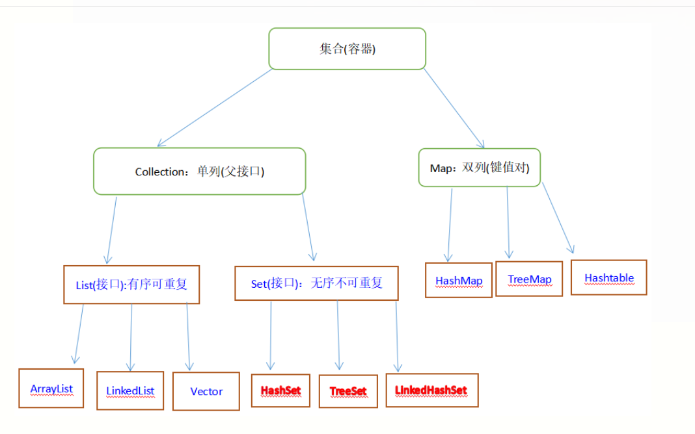

### 今天的内容

> 1.集合

### 1.集合【重点】

#### 1.1为什么使用集合

> 集合和数组是一样的都是用来存储数据的！！！
>
> 真实的开发的时候，使用的是集合不是数组，为啥？
>
> 数组存数据:
>
> ​	1.数组的容量是固定的
>
> ​	2.数组封装的方法是比较少的。大部分需要程序员需要自己写
>
> Java封装了集合，是一些类。咱们只需要实例化对象，调用方法即可完成一些需求。

#### 1.2集合的架构

> 官方的API
>
> ```
> interface  Collection<E>:  Java 集合的总接口。
> Collection接口下面有两个重要的子接口:   List 和Set
> --| List:   接口  有序集合（也称为序列 ）   特征:  存放放的数据是有序的。可以重复的。
> --|--|  ArrayList：  实现类，重写List和COllection所有的抽象方法。并且还有自己独有的方法
> --|--|  LInkedList：  实现类，重写List和COllection所有的抽象方法。并且还有自己独有的方法
> --| Set:    接口        特征:  存放放的数据是无序的。不可以重复的。   
> --|--|  HashSet：  实现类，重写Set和COllection所有的抽象方法。并且还有自己独有的方法
> --|--|  TreeSet：  实现类，重写Set和COllection所有的抽象方法。并且还有自己独有的方法
> ```
>
> 



#### 1.3Collection接口

> 学习Collection就是学习这个接口下面的方法，对象调用方法。他是接口，无法进行实例化啊
>
> 咋办？自己写一个类去实现Collection
>
> ```
> 增:
> 	boolean add(E e);添加数据到集合中
> 	boolean addAll(Collection<? extends E> c);将一个集合添加另外一个集合
> 删:
> 	boolean remove(Object obj);//通过元素来删除集合中的元素
> 	boolean removeAll(Collection<? extends E> c);删除两个集合中的交集。共同的元素
> 	void clear();  清空
> 查:
> 	int size(); 获取集合中的元素的个数
> 	boolean contains(Object o);判断集合中是否包含一个元素
> 	boolean isEmpty();判断是否为空。为空就是true。不为空就是false
> 	Object[] toArray();将集合转为数组。
> ```
>
> 

```Java
package com.qf.a_collection;

import java.util.ArrayList;
import java.util.Collection;
import java.util.Iterator;

/**
 * description:
 * 公司:千锋教育
 * author:博哥
 * 公众号:Java架构栈
 */

public class Demo1 {
    public  static void main(String[] args) {
        //Java中封装的有实现类  ArrayList
        Collection<String> collection = new ArrayList<>();
        //但是 只能使子类重写父类的那个方法，子类独有的方法不能使用！！
        System.out.println(collection);//[]
        collection.add("狗蛋");
        collection.add("吴彦祖");
        collection.add("狗蛋");
        collection.add("闫世达");
        System.out.println(collection);//[狗蛋, 吴彦祖, 闫世达]
        Collection<String> collection1 = new ArrayList<>();
        collection1.add("嘻嘻");
        collection1.add("哈哈");
        collection.addAll(collection1);//将collection1数据存到collection
        System.out.println(collection);//[狗蛋, 吴彦祖, 闫世达, 嘻嘻, 哈哈]
        Collection<Integer> collection2 = new ArrayList<>();
        collection2.add(21);
        collection2.add(22);
        collection2.add(23);
        //collection.addAll(collection2);
        System.out.println(collection.remove("闫世达"));
        System.out.println(collection);//被删除以后的集合的数据
        System.out.println(collection.remove("闫世达"));//如被删除的元素如果没有话的，就是false
        collection.remove("狗蛋");
        System.out.println(collection);//[吴彦祖, 狗蛋, 嘻嘻, 哈哈]
        Collection<String> collection3 = new ArrayList<>();
        collection3.add("嘻嘻");
        collection3.add("呵呵");
        collection3.add("哈哈");
        collection.removeAll(collection3);
        System.out.println(collection);//[吴彦祖, 狗蛋]
//        collection.clear();
//        System.out.println(collection);//[]
        System.out.println(collection.size());//2
        System.out.println(collection.contains("狗蛋"));//true
        System.out.println(collection.isEmpty());//false 因为不为空

        Object[] objects = collection.toArray();
        for (int i = 0; i < objects.length; i++) {
            System.out.println(objects[i]);
        }

    }
}

```

#### 1.4遍历数据

```
三种遍历方式：
1.使用for循环进行遍历
2.使用增强for循环遍历
3.使用迭代器进行遍历

```

##### 1.4.1使用for循环进行遍历

```Java
package com.qf.a_collection;

import java.util.ArrayList;
import java.util.Collection;

/**
 * description:
 * 公司:千锋教育
 * author:博哥
 * 公众号:Java架构栈
 */
public class Demo2 {
    public static void main(String[] args) {
        Collection<Boolean> col = new ArrayList<>();
        col.add(true);
        col.add(false);
        col.add(true);
        col.add(true);
        System.out.println(col);
        Object[] objects = col.toArray();

        for (int i = 0; i < objects.length; i++) {
            System.out.println(objects[i]);
        }
    }
}

```

##### 1.4.2增强for循环

> 语法格式:
>
> ```
> for (类型  临时变量: 遍历的数组或者集合) {
> 	sout（临时变量）
> }
> ```
>
> 

```Java
package com.qf.a_collection;

import java.util.ArrayList;
import java.util.Collection;

/**
 * description:
 * 公司:千锋教育
 * author:博哥
 * 公众号:Java架构栈
 */
public class Demo3 {
    public static void main(String[] args) {
        Collection<Boolean> col = new ArrayList<>();
        col.add(true);
        col.add(false);
        col.add(true);
        col.add(true);
        System.out.println(col);
        //直接写代码 iter
        for (Boolean aBoolean : col) {
            System.out.println(aBoolean);
        }
    }
}

```

##### 1.4.3迭代器

> 也是用来遍历数据的。

```Java
package com.qf.a_collection;

import java.util.ArrayList;
import java.util.Collection;
import java.util.Iterator;

/**
 * description:
 * 公司:千锋教育
 * author:博哥
 * 公众号:Java架构栈
 */
public class Demo4 {
    public static void main(String[] args) {
        Collection<String> collection1 = new ArrayList<>();
        collection1.add("嘻嘻");
        collection1.add("呵呵");
        collection1.add("哈哈");
        //1.先将集合变成迭代器对象
        Iterator<String> iterator = collection1.iterator();
        //iterator 这个里面还是有数据的！！！
        //boolean	hasNext()
        //如果迭代具有更多元素，则返回 true 。
        //System.out.println(iterator.hasNext());//true
        //E next()
        //返回迭代中的下一个元素。并将光标挪到当前元素上面
        //   [嘻嘻， 呵呵， 哈哈]
        //                  |
//        System.out.println(iterator.next());//嘻嘻
//        System.out.println(iterator.hasNext());//true
//        System.out.println(iterator.next());//呵呵
//        System.out.println(iterator.hasNext());//true
//        System.out.println(iterator.next());//哈哈
//        System.out.println(iterator.hasNext());//false
       // System.out.println(iterator.next());
        while (iterator.hasNext()) {

            System.out.println(iterator.next());
        }

    }
}

```

总结迭代器遍历数据

```
1.先把集合变成迭代器对象
2.通过while循环   hasNext方法  next()
```

上午讲的内容

```
1.集合的架构
	Collection  父接口
		List
			ArrayList  实现类
			LinkedList 实现类
		Set
			HashSet
			TreeSet
2.Collection下面的方法
	add
	addAll
	remove
	clear
	size
	conatins
	toArray
	isEmpty
3.遍历集合中数据
	1.for循环
	2.增强for循环
	3.迭代器
	
```

#### 1.5集合中存对象【重点】

> 集合中存 八大基本数据类型，只能写包装类。String， 可以存自定义的对象
>
> 

```Java
package com.qf.a_collection;

import java.util.ArrayList;
import java.util.Collection;

/**
 * description:
 * 公司:千锋教育
 * author:博哥
 * 公众号:Java架构栈
 */
class Person {
    String name;
    int age;
    public Person (String name, int age) {
        this.name = name;
        this.age = age;
    }

}

public class Demo5 {
    public static void main(String[] args) {
        Collection<Person> collection = new ArrayList<>();
        collection.add(new Person("吕布", 21));
        collection.add(new Person("曹操", 28));
        collection.add(new Person("董卓", 58));
        System.out.println(collection);//可以存对象的

        //将数据遍历出来
        for (Person person : collection) {
            System.out.println(person.name + ":" + person.age);
            System.out.println("==========");
        }
    }
}

```

练习:

```
一个集合中存的是Student对象
	name  age 私有话。
	遍历 将name和age取出来
```

```Java
package com.qf.a_collection;

import java.util.ArrayList;
import java.util.Collection;

/**
 * description:
 * 公司:千锋教育
 * author:博哥
 * 公众号:Java架构栈
 */
class Student {
    private String name;
    private int age;

    //对属性进行赋值
    public Student(String name, int age) {
        this.name = name;
        this.age = age;
    }

    public String getName() {
        return name;
    }

    public int getAge() {
        return age;
    }
}
public class Demo6 {
    public static void main(String[] args) {
        Collection<Student> stus = new ArrayList<>();
        stus.add(new Student("狗蛋", 21));
        stus.add(new Student("永杰", 25));
        stus.add(new Student("世奇", 83));
        System.out.println(stus);
        for (Student student : stus) {
            System.out.println(student.getName());
            System.out.println(student.getAge());
        }
    }
}

```

#### 1.6List集合

> 开发中不用Collection  一般用List。
>
> List是一个接口，是Collection的子接口。
>
> Collection 咱们学过方法，List接口能不能用COllection方法 为啥？  继承关系
>
> List接口下面比Collection接口下面的方法更多！！！
>
> 讲List下面的方法，只讲List独有的。
>
> 特征 List:  存的数据是有序的，可以重复的
>
> ```
> Collection中的方法，List肯定是有点，是继承关系，上午讲的COllection下面的方法 在List照样能用
> 只讲List独有方法
> 增:
> 	void  add(int index, E e);在指定的下标的位置添加指定的元素
> 	boolean addAll(int index, Collection<? extends E> c);在指定的下标下面添加指定的集合
> 删:
> 	Collection下面remove  是通过元素删除的
> 	E remove(int index); 通过下标来删除元素，返回值 是被删除的那个元素
> 改:
> 	E  set(int index, E element);通过指定的索引下标替换某一个元素。返回值是被替换的元素
> 查:
> 	E get(int index); 通过下标获取指定的元素
> 	int  indexOf(Object o);获取指定元素的下标
> 	int lastIndexOf(Object o)；获取指定元素的最后一次出现下标的
> 	List<E> subList(int fromIndex, int toIndex); 截取一个集合
> ```
>
> 

```java 
package com.qf.b_list;

import java.util.ArrayList;
import java.util.List;

/**
 * description:
 * 公司:千锋教育
 * author:博哥
 * 公众号:Java架构栈
 */
public class Demo1 {
    public static void main(String[] args) {
        List<String> list = new ArrayList<>();
        list.add("安徽板面加狮子头");
        list.add("北京烤手机");
        list.add("烧饼加馍馍");
        System.out.println(list);
        list.add(1, "胡辣汤");
        list.add("北京烤手机");
        System.out.println(list);

        List<String> list1 = new ArrayList<>();
        list1.add("烤肠");
        list1.add("大肠赤身");
        list1.add("蜂蜜灌大肠");
        list.addAll(2, list1);
        System.out.println(list);//[安徽板面加狮子头, 胡辣汤, 烤肠, 大肠赤身, 蜂蜜灌大肠, 北京烤手机, 烧饼加馍馍]
        System.out.println(list.remove(1));//删除的数据  胡辣汤
        System.out.println(list);//被删除之后的数据  [安徽板面加狮子头, 烤肠, 大肠赤身, 蜂蜜灌大肠, 北京烤手机, 烧饼加馍馍]
        System.out.println(list.set(0, "兰州拉面"));
        System.out.println(list);//[兰州拉面, 烤肠, 大肠赤身, 蜂蜜灌大肠, 北京烤手机, 烧饼加馍馍]
        System.out.println(list.get(3));

        System.out.println(list.indexOf("烤肠"));//1
        System.out.println(list.lastIndexOf("北京烤手机"));//6

        List<String> strings = list.subList(2, 4);//要头不要尾
        System.out.println(strings);

    }
}

```

Collection 和List 我讲的都要记，明天默写！！！

#### 1.7List的三种遍历方式

```
1.for循环
2.增强for循环
3.迭代器
```

##### 1.7.1for循环和增强for循环

```Java
package com.qf.b_list;

import java.util.ArrayList;
import java.util.List;

/**
 * description:
 * 公司:千锋教育
 * author:博哥
 * 公众号:Java架构栈
 */
public class Demo2 {
    public static void main(String[] args) {
        List<String> list = new ArrayList<>();
        list.add("安徽板面加狮子头");
        list.add("北京烤手机");
        list.add("烧饼加馍馍");
        System.out.println(list);//[安徽板面加狮子头, 北京烤手机, 烧饼加馍馍]
        for (int i = 0; i < list.size(); i++) {
            //刚好通过get方法的遍历的
            System.out.println(list.get(i));
        }
        System.out.println("===========");
        for (String s : list) {
            System.out.println(s);
        }
        System.out.println("---------");

    }
}

```

##### 1.7.2迭代器

```Java
package com.qf.b_list;

import java.util.ArrayList;
import java.util.List;
import java.util.ListIterator;

/**
 * description:
 * 公司:千锋教育
 * author:博哥
 * 公众号:Java架构栈
 */
public class Demo3 {
    public static void main(String[] args) {
        List<String> list = new ArrayList<>();
        list.add("安徽板面加狮子头");
        list.add("北京烤手机");
        list.add("烧饼加馍馍");
        System.out.println(list);//[安徽板面加狮子头, 北京烤手机, 烧饼加馍馍]
        ListIterator<String> sli = list.listIterator();
        while (sli.hasNext()) {
            System.out.println(sli.next());
        }
        System.out.println("========");
        //到此位置 光标在最后
        while (sli.hasPrevious()) {
            System.out.println(sli.previousIndex());
            System.out.println(sli.previous());
        }

    }
}

```

```Java
package com.qf.b_list;

import java.util.ArrayList;
import java.util.List;
import java.util.ListIterator;

/**
 * description:
 * 公司:千锋教育
 * author:博哥
 * 公众号:Java架构栈
 */
public class Demo4 {
    public static void main(String[] args) {
        List<String> list = new ArrayList<>();
        list.add("安徽板面加狮子头");
        list.add("北京烤手机");
        list.add("烧饼加馍馍");
        ListIterator<String> stringListIterator = list.listIterator(list.size());
        while (stringListIterator.hasPrevious()) {
            System.out.println(stringListIterator.previous());
        }
    }
}

```

#### 1.8ArrayList类

> 从开发角度来讲
>
> ```Java
> package com.qf.c_arrayList;
> 
> import java.util.*;
> import java.util.List;
> 
> /**
>  * description:
>  * 公司:千锋教育
>  * author:博哥
>  * 公众号:Java架构栈
>  */
> public class Demo1 {
>     public static void main(String[] args) {
>         List<String> list1 = new ArrayList<>();
>         list1.add("狗蛋");
>         list1.add("嘻嘻");
>         list1.add("啊哈哈");
>         //增删改查 的方法即可
>     }
> }
> 
> ```
>
> ArrayList的底层是数组Object[]。  默认的容量是10。如果超过10会自动扩容
>
> 一旦超过10扩容是原来的1.5倍
>
> https://blog.csdn.net/kevinmeanscool/article/details/122116738
> 源码:
>
> ```Java
>     /**
>      * Default initial capacity.
>      */
>     private static final int DEFAULT_CAPACITY = 10;
> 
> 可以看出来  ArrayList 底层是数组
>     /**
>      * The array buffer into which the elements of the ArrayList are stored.
>      * The capacity of the ArrayList is the length of this array buffer. Any
>      * empty ArrayList with elementData == DEFAULTCAPACITY_EMPTY_ELEMENTDATA
>      * will be expanded to DEFAULT_CAPACITY when the first element is added.
>      存储ArrayList元素的数组缓冲区。ArrayList的容量就是这个数组缓冲区的长度。添加第一个元素时，任何elementData==DEFAULTCAPACITY_empty_elementData的空ArrayList都将扩展为DEFAULT_CAPACITY。 默认容量是10
>      */
>     transient Object[] elementData; // non-private to simplify nested class access
> 
> 
> 
> 核心的add方法
>   /**
>      * Appends the specified element to the end of this list.
>      *将指定的元素追加到此列表的末尾。
>      * @param e element to be appended to this list
>      * @return <tt>true</tt> (as specified by {@link Collection#add})
>      */
>     public boolean add(E e) {
>     	//确保内部容量一个方法
>         ensureCapacityInternal(size + 1);  // Increments modCount!!
>         elementData[size++] = e;
>         return true;
>     }
>     
>     
>     private void ensureCapacityInternal(int minCapacity) {
>         ensureExplicitCapacity(calculateCapacity(elementData, minCapacity));
>     }
>     
>     //确保显示容量的方法
>     private void ensureExplicitCapacity(int minCapacity) {
>         modCount++;
> 
>         // overflow-conscious code  
>         //minCapacity 最小的容量
>         //elementData.length  elementData元素的长度
>         if (minCapacity - elementData.length > 0)
>             grow(minCapacity);
>     }
> 
> 	private void grow(int minCapacity) {
>         // overflow-conscious code
>         int oldCapacity = elementData.length;//数组的长度
>         //>>      :     右移运算符，num >> 1,相当于num除以2
>         // int newCapacity = oldCapacity + oldCapacity / 2;   1.5倍数
>         int newCapacity = oldCapacity + (oldCapacity >> 1);
>         //newCapacity  新的数组容量
>         if (newCapacity - minCapacity < 0)
>             newCapacity = minCapacity;
>         if (newCapacity - MAX_ARRAY_SIZE > 0)
>             newCapacity = hugeCapacity(minCapacity);
>         // minCapacity is usually close to size, so this is a win:
>         // Arrays.copyOf  数组的复制  把一个数组的内容复制到另外一个数组
>         //elementData  原来的数组的内容
>         //[1,2,3,4,5,6,7,8,9,0]
>         //[1,2,3,4,5,7,6,8,9,0,0,0,0,0,0]
>         //add(98)
>         //[1,2,3,4,5,7,6,8,9,0,98,0,0,0,0]
>         elementData = Arrays.copyOf(elementData, newCapacity);
>     }
> ```

作业:

```
1.Collection下面的方法
2.List接口下面方法
3.遍历的方式
4.ArrayList源码
```

