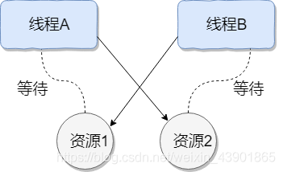
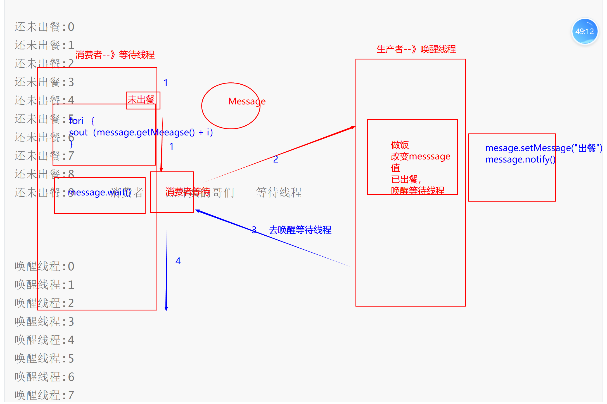

```
周二的回顾
1.线程的概念
	是进程(应用程序软件)最小的基本单位
2.在Java中代码咋写线程
	1.继承Thread类
	2.实现Runnable接口
	3.实现Callable接口
3.Thread相关的方法
	
4.同步锁
	目的:   当多个线程操作同一个资源的时候，会发生数据不安全性！！！
	加锁目的:   保证只有一个线程在操作咱们的资源  卖票的！！！
	1.同步方法  synchronized
	2.同步代码块  
	3.lock

	
```


### 今天的内容

> 1.守护线程
>
> 2.线程的生命周期
>
> 3.死锁
>
> 4.关于Object类下面和线程有关的方法【重点】
>
> 5.生产者消费者【难点重点】

### 1.守护线程【非重点】

> 守护线程是用来守护其他线程的（其他线程不是守护）
>
> 每个线程可能也可能不会被标记为守护程序。（靠咱们的代码来处理）
>
> 开启线程，一般不是守护线程，除非咱们使用代码将他变成守护线程
>
> 被守护的线程一旦结束，守护线程就会挂掉。
>
> 守护线程依附于非守护线程。如果非守护线程消亡。那么守护没有执行完也要挂掉！！！
>
> 帝王制度。皇帝（被守护线程）死了，妻子（守护线程）要陪葬

```Java
package com.qf.a_demon;

/**
 * description:
 * 公司:千锋教育
 * author:博哥
 * 公众号:Java架构栈
 */
class MyThread1 implements Runnable {
    @Override
    public void run() {
        for (int i = 0; i < 1000; i++) {
            System.out.println(Thread.currentThread().getName() + ":" + i);
        }
    }
}
public class Demo1 {
    public static void main(String[] args) {
        Thread thread = new Thread(new MyThread1(), "狗蛋");
      //setDaemon(boolean on)
        //将此线程标记为daemon线程或用户线程。 当运行的唯一线程都是守护进程线程时，Java虚拟机将退出。
        //线程启动前必须调用此方法。
        thread.setDaemon(true);//设置为守护线程
        thread.start();
        System.out.println(Thread.currentThread().isDaemon());
        for (int i = 0; i < 100; i++) {
            System.out.println("主线程:" + i);
        }

    }
}

```


### 2.线程的生命周期

> - 新建状态:
>
>   使用 **new** 关键字和 **Thread** 类或其子类建立一个线程对象后，该线程对象就处于新建状态。它保持这个状态直到程序 **start()** 这个线程。
>
> - 就绪状态:
>
>   当线程对象调用了start()方法之后，该线程就进入就绪状态。就绪状态的线程处于就绪队列中，要等待JVM里线程调度器的调度。
>
> - 运行状态:
>
>   如果就绪状态的线程获取 CPU 资源，就可以执行 **run()**，此时线程便处于运行状态。处于运行状态的线程最为复杂，它可以变为阻塞状态、就绪状态和死亡状态。
>
> - 阻塞状态:
>
>   如果一个线程执行了sleep（睡眠）、suspend（挂起）等方法，失去所占用资源之后，该线程就从运行状态进入阻塞状态。在睡眠时间已到或获得设备资源后可以重新进入就绪状态。可以分为三种：
>
>   - 等待阻塞：运行状态中的线程执行 wait() 方法，使线程进入到等待阻塞状态。
>   - 同步阻塞：线程在获取 synchronized 同步锁失败(因为同步锁被其他线程占用)。
>   - 其他阻塞：通过调用线程的 sleep() 或 join() 发出了 I/O 请求时，线程就会进入到阻塞状态。当sleep() 状态超时，join() 等待线程终止或超时，或者 I/O 处理完毕，线程重新转入就绪状态。
>
> - 死亡状态:
>
>   一个运行状态的线程完成任务或者其他终止条件发生时，该线程就切换到终止状态。


### 3.死锁

> 开发中禁止使用死锁
>
> 面试会问：
>
> ​	应用场景：并发场景，多线程。线程之间互不相让。
>
> 线程加锁的目的就是为了安全。但是物极必反。
>
> 死锁是一种状态，当两个线程互相持有对方的资源的时候，却又不主动释放对方的资源。会导致死锁。代码不会正常的执行。这两个线程就会僵持住。哪个线程都不能往下执行。
>
> 线程1  有锁1   线程1想要使用锁2
>
> 线程 2   有锁2   线程2想要使用锁1
>
> 开锁公司需要身份证。开锁公司给你说: 先出示身份证再开锁   你说:  先开锁，因为身份证在屋里面  所以僵持不下
>
> 
>
> 
>
> [(6条消息) 什么是线程死锁?如何避免死锁?_TanaStudy的博客-CSDN博客](https://blog.csdn.net/weixin_43901865/article/details/115508477)

```
线程1拿到了锁1对象
线程2拿到了锁2对象
等待锁2的释放...
等待锁1的释放...
```

```Java
package com.qf.c_sisuo;

/**
 * description:
 * 公司:千锋教育
 * author:博哥
 * 公众号:Java架构栈
 */
class DeadLock implements Runnable {
    private boolean flag;//标记属性
    private Object obj1;//资源1
    private Object obj2;//资源2
    //有参构造方法


    public DeadLock(boolean flag, Object obj1, Object obj2) {
        this.flag = flag;
        this.obj1 = obj1;
        this.obj2 = obj2;
    }

    @Override
    public void run() {
        if (flag) {//flag为true的时候  让线程1进来执行if语句中代码
            synchronized (obj1) {//锁obj 1资源
                System.out.println(Thread.currentThread().getName() + "拿到了obj1对象");

                try {
                    Thread.sleep(1000);
                } catch (InterruptedException e) {
                    e.printStackTrace();
                }
                //线程1走到这个方法不走了，休眠了
                System.out.println("我的线程1想拿obj2这个资源");
                synchronized (obj2) {//如果obj2一直没有释放，是锁不住这个资源的！！！
                    System.out.println(Thread.currentThread().getName() + "拿到了obj2对象");

                }

            }
        }
        
        //线程1拿到了obj1对象
        //线程2拿到了obj2对象
        //我的线程1想拿obj2这个资源
        //线程1拿到了obj2对象
        //
        //Process finished with exit code 0
        if (!flag) {//flag为false的时候  让线程2进来执行if语句中代码
            synchronized (obj2) {//锁obj 1资源
                System.out.println(Thread.currentThread().getName() + "拿到了obj2对象");
                try {
                    Thread.sleep(10000);
                } catch (InterruptedException e) {
                    e.printStackTrace();
                }
                System.out.println("我的线程2想拿obj1这个资源");
                synchronized (obj1) {//如果obj2一直没有释放，是锁不住这个资源的！！！
                    System.out.println(Thread.currentThread().getName() + "拿到了obj1对象");

                }
            }
        }
    }
}
public class Demo1 {
    public static void main(String[] args) {
        Object obj1 = new Object();
        Object obj2 = new Object();
        //第一个线程
        DeadLock deadLock1 = new DeadLock(true, obj1, obj2);
        new Thread(deadLock1, "线程1").start();
        //第二个线程
        DeadLock deadLock2 = new DeadLock(false, obj1, obj2);
        new Thread(deadLock2, "线程2").start();
    }
}

```


### 4.和线程相关的Object类方法

> Object类的方法
>
> ```
> public final void wait(long timeout)
>              throws InterruptedException
> ```
>
> 导致当前线程等待，直到另一个线程调用此对象的[`notify()`](https://www.matools.com/file/manual/jdk_api_1.8_google/java/lang/Object.html#notify--)方法或[`notifyAll()`](https://www.matools.com/file/manual/jdk_api_1.8_google/java/lang/Object.html#notifyAll--)方法，才能够唤醒当前等待线程！！！
>
> 总结：两个线程，其中一个线程  对象.wait()方法，那么这个线程就会阻塞。什么叫阻塞？这个线程暂时
>
> 不执行了。如何让这个线程继续往下执行呢？再开另外一个线程。对象.notify()去唤醒另外一个线程！！！
>
> ```
> 
> 等待线程:0
> 等待线程:1
> 等待线程:2
> 等待线程:3
> 等待线程:4
> 等待线程:5
> 等待线程:6
> 等待线程:7
> 等待线程:8
> 等待线程:9  以上是等待线程
> 
> 唤醒线程:0
> 唤醒线程:1
> 唤醒线程:2
> 唤醒线程:3
> 唤醒线程:4
> 唤醒线程:5
> 唤醒线程:6
> 唤醒线程:7
> 唤醒线程:8
> 唤醒线程:9
> 唤醒线程已经将等待线程唤醒  以上是唤醒线程   唤醒线程目的是唤醒等待线程
> 
> 
> 野猪:0
> 野猪:1
> 野猪:2
> 野猪:3
> 野猪:4
> 野猪:5
> 野猪:6
> 野猪:7
> 野猪:8
> 野猪:9  以上是等待线程
> 
> Process finished with exit code 0
> 
> ```
>
> 把消费者看成等待线程！！！   把生产者看成唤醒线程！！！
>
> 消费一个黄焖鸡！！！
>
> ​    
>
> ```
> 
> 还未出餐:0
> 还未出餐:1
> 还未出餐:2
> 还未出餐:3
> 还未出餐:4
> 还未出餐:5
> 还未出餐:6
> 还未出餐:7
> 还未出餐:8
> 还未出餐:9     消费者   点外卖的哥们   等待线程
> 
> 
> 
> 唤醒线程:0
> 唤醒线程:1
> 唤醒线程:2
> 唤醒线程:3
> 唤醒线程:4
> 唤醒线程:5
> 唤醒线程:6
> 唤醒线程:7
> 唤醒线程:8
> 唤醒线程:9
> 唤醒线程已经将等待线程唤醒     生产者   唤醒线程
> 
> 
> 已经出餐0
> 已经出餐1
> 已经出餐2
> 已经出餐3
> 已经出餐4
> 已经出餐5
> 已经出餐6
> 已经出餐7
> 已经出餐8
> 已经出餐9      消费者得到     等待线程中
> 
> Process finished with exit code 0
> 
> ```
>
> 
>
> 

总结：

```
新建两个线程：
	一个是等待线程
		等待线程中代码从上往下执行，但是使用object.wait()方法以后，咱们当前的线程就等待了，阻塞了
		到wait之后代码暂时不会往下执行了，需要借助于另外一个线程进行唤醒。
	一个是唤醒线程
		唤醒线程使用object.notify方法去将 等待线程中的正在等待的线程进行唤醒，让等待线程继续往下执行
		
好比：  在大学谈了个女朋友。你给你女朋友打电话晚上去吃饭，你女朋友说你来接我吧，到楼底下等着我
你在楼底下等着，你就是等待线程。你女朋友就是唤醒线程。你女朋友要化妆。化两个小时。你就得站在楼底下等两个小时，等你女朋友化完妆以后，她来唤醒你，说 走吧。然后你和她一起开开心心的去吃
	咱们wait和notify方法 实现线程之间的通信问题。
	
	
	我点了一份宫保鸡丁  我得等待  就是等待线程
	商家做好以后，唤醒我  别等了哥们。做好了吃吧  商家就是唤醒线程
```

```Java
package com.qf.c_object;

//为啥要写Message这个类？
//wait需要对象.wait()   先有类然后再创建对象  message.wait()
class Message {
    private String message;//信息

    public Message(String message) {
        this.message = message;
    }

    public String getMessage() {
        return message;
    }

    public void setMessage(String message) {
        this.message = message;
    }

}
//等待线程
class WaiterThread implements Runnable {
    private Message msg;//要使用msg对象    msg.wait()

    public WaiterThread(Message msg) {
        this.msg = msg;
    }
    //为啥写构造方法，WaiterThread和NotifierThread里面 保证是同一个message对象

    @Override
    public void run() {
        //等待线程中获取线程的名字
        String name = Thread.currentThread().getName();
        System.out.println( name + "等待唤醒的时间:" + System.currentTimeMillis());
       //wait等待唤醒的时间:1670381924163
        synchronized (msg) {
            try {
                msg.wait();//当前线程会等待 不会往下执行。
                //为啥要加synchronized，当调用wait方法的时候
                //会自动释放锁，然后msg对象放到对象的等待池中
            } catch (InterruptedException e) {
                e.printStackTrace();
            }
            System.out.println(name + "被唤醒的时间:" + System.currentTimeMillis());
            System.out.println(name + "线程"+ msg.getMessage());
        }
    }
}
//唤醒线程
class NotifierThread implements Runnable {
    private Message msg;//使用msg对象  msg.nitify() 去唤醒等待线程

    public NotifierThread(Message msg) {
        this.msg = msg;
    }

    @Override
    public void run() {
        try {
            Thread.sleep(10000);//唤醒线程睡10秒
        } catch (InterruptedException e) {
            e.printStackTrace();
        }
        String name =Thread.currentThread().getName();
        System.out.println(name + "开始唤醒等待线程");
        synchronized (msg) {
            msg.setMessage("我是修改之后的message对象");
            //msg.notify();//去唤醒等待线程让等待线程继续往下执行
            msg.notifyAll();//去唤醒所有的等待线程
        }
    }
}
public class Demo1 {
    public static void main(String[] args) {
        Message message = new Message("我是message对象");
        WaiterThread waiterThread = new WaiterThread(message);

        //如果有两个等到线程呢？
        NotifierThread notifierThread = new NotifierThread(message);
        new Thread(waiterThread, "wait").start();
        new Thread(waiterThread, "wait1").start();
        new Thread(notifierThread, "notify").start();
    }
}

```

```Java
package com.qf.d_waitnotify;

/**
 * description:
 * 公司:千锋教育
 * author:博哥
 * 公众号:Java架构栈
 */
class Message {
    private String message;

    public Message(String message) {

        this.message = message;
    }

    public String getMessage() {
        return message;
    }

    public void setMessage(String message) {
        this.message = message;
    }
}
class WaitThread implements Runnable{
    private Message message;

    public WaitThread(Message message) {
        this.message = message;
    }

    @Override
    public void run() {

        for (int i = 0; i < 10; i++) {
            System.out.println(Thread.currentThread().getName()+ ":" + i);
        }

        //0x998.wait()
        synchronized (message) {
            try {
                message.wait();//线程等待
                //为啥要用！！！当调用wait方法的时候，会自动的释放这个锁
                //把资源 message 放到对象的等待池中。
            } catch (InterruptedException e) {
                e.printStackTrace();
            }
        }


        for (int i = 0; i < 10; i++) {
            System.out.println(Thread.currentThread().getName()+ i);
        }
    }
}
class NotifyThread implements Runnable{
    private Message message;

    public NotifyThread(Message message) {
        this.message = message;
    }
    @Override
    public void run() {
        try {
            Thread.sleep(10000);
        } catch (InterruptedException e) {
            e.printStackTrace();
        }
        for (int i = 0; i < 10; i++) {
            System.out.println(Thread.currentThread().getName()+ ":" + i);
        }
       //0x998.notify();
        synchronized (message) {
            message.setMessage("已经出餐");
            //message.notify();
            message.notifyAll();
        }
        System.out.println("唤醒线程已经将等待线程唤醒");
    }
}
public class Demo1 {
    public static void main(String[] args) {
        Message message = new Message("还未出餐");//0x998
        WaitThread waitThread = new WaitThread(message);
        NotifyThread notifyThread = new NotifyThread(message);
        new Thread(waitThread, "等待线程1").start();
        new Thread(waitThread, "等待线程2").start();
        new Thread(notifyThread, "唤醒线程").start();
    }
}

```

总结：

```
Object类
wait()
notify()
notifyAll()
```


### 5.join方法【开发不用】

> 为啥join方法放在wait方法之后，因为join方法的底层是wait()方法
>
> 作用：让主线程等待，一直等待他的子线程执行完以后，才执行主线程
>
> 控制线程执行的顺序的！！！

```java
package com.qf.d_join;

class Mythread1 implements Runnable {
    @Override
    public void run() {
        for (int i = 0; i < 1000; i++) {
            System.err.println(Thread.currentThread().getName() + ":" + i);
        }

    }
}
public class Demo1 {
    public static void main(String[] args) throws InterruptedException {
        Thread thread = new Thread(new Mythread1());
        thread.start();
        thread.join();//主线程开始等待子线程执行完以后再执行主线程
        for (int i = 0; i < 1000; i++) {
            System.out.println(Thread.currentThread().getName() + ":" + i);
        }

    }
}

```

```Java
package com.qf.d_join;

class FatherThread implements Runnable {
    @Override
    public void run() {

        //在FatherThread线程中去启动SonThread这个线程
        Thread thread = new Thread(new SonThread());
        //SonThread  是在FatherThread线程启动的，那就意味着
        //SonThread是FatherThread的一个子线程
        thread.start();
        try {
            thread.join();//thread的父线程
            //让主线程（父线程）等待，等到子线程执行完以后再执行父线程
        } catch (InterruptedException e) {
            e.printStackTrace();
        }
        for (int i = 0; i < 1000; i++) {
            System.out.println("父亲线程:" + i);
        }


    }
}
class SonThread implements Runnable {
    @Override
    public void run() {
        for (int i = 0; i < 1000; i++) {
            System.err.println("儿子线程:"+ i);
        }
    }
}
public class Demo2 {
    public static void main(String[] args) {
        new Thread(new FatherThread()).start();
    }
}

```

面试题：

```
你如何控制两个线程的执行顺序。
1.sleep  让另外一个线程先执行。睡完以后再执行其他线程
2.join   使用join让子线程先执行完
3.线程池

```

### 6.生产者消费者模式

> 生活中案例：
>
> ​		卖家：汽车厂商
>
> ​		买家:   咱们班40位同学
>
> ​		梦圆想买一个BYD汉 ，电车定完车以后需要等。
>
> ​		梦圆告知汽车厂商我要买车。如果有，直接发货。如果没有呢？ 梦圆会进入到等待状态。等汽车厂商生产好以后，唤醒梦圆的等待线程。然后梦圆来买车。如果今天没有人买车。汽车厂商进入到等待状态。
>
> 如果有人买车，立马唤醒汽车厂商线程，让他赶紧造车
>
> 生产者:  汽车厂商
>
> 消费者:   梦圆
>
> 美团  饿了吗  等都是这种模式
>
> 梦圆（消费者）想吃饭？咋办？
>
> 去饭店，然后说老板(生产者)我要吃酸菜鱼。老板说好 你等着。梦圆就进入到等待wait状态！！
>
> 饭做好了，老板，唉 哥们  做好了吃饭（唤醒梦圆（消费者））。梦圆在吃饭的时候
>
> 饭店在干嘛没有人再来吃饭。饭店阻塞状态 等待，等再上人。


```
现在看第一个问题：
	为啥是消费者抢到这个执行权，等了10秒以后才执行消费这线程！！！我让消费者睡了10s
	因为goods  是false 肯定生产者线程先抢到这个执行权，为啥？因为消费者睡觉。
	但是没有执行生产者，为啥？因为生产者在wait 有车。一旦wait 等过了10s以后
	消费者线程睡醒了，之后先执行消费者
	
	true之后又唤醒了生产者，让生产者 去生产者
	

消费者购买了:五菱，价格为:76.0
生产者生产了:兰博基尼价格为:200.0
消费者购买了:兰博基尼，价格为:200.0
生产者生产了:玛莎拉蒂价格为:300.0
消费者购买了:玛莎拉蒂，价格为:300.0
生产者生产了:兰博基尼价格为:200.0
消费者购买了:兰博基尼，价格为:200.0
生产者生产了:玛莎拉蒂价格为:300.0
消费者购买了:玛莎拉蒂，价格为:300.0
生产者生产了:兰博基尼价格为:200.0
消费者购买了:兰博基尼，价格为:200.0
生产者生产了:玛莎拉蒂价格为:300.0

```

```Java
package com.qf.e_shenchanzhexiaofezhe;

//为啥要写这个类？是作为两个线程之间的桥梁的共享资源
class Goods {
    private String name;//商品的价格
    private double price;//商品的价格
    private boolean isProduct;//是否需要生产？
    //true需要生产  false  不需要生产

    public Goods(String name, double price, boolean isProduct) {
        this.name = name;
        this.price = price;
        this.isProduct = isProduct;
    }

    public String getName() {
        return name;
    }

    public void setName(String name) {
        this.name = name;
    }

    public double getPrice() {
        return price;
    }

    public void setPrice(double price) {
        this.price = price;
    }

    public boolean isProduct() {
        return isProduct;
    }

    public void setProduct(boolean product) {
        isProduct = product;
    }
}
//消费者线程
class Customer implements Runnable {
    private Goods goods;

    public Customer(Goods goods) {
        this.goods = goods;
    }

    @Override
    public void run() {
        //消费者消费
        try {
            Thread.sleep(10000);//这个可写可不写
        } catch (InterruptedException e) {
            e.printStackTrace();
        }
        //生产者一直生产，消费者一直消费
        while(true) {
            synchronized (goods) {
                //一直消费。判断商品是否有无？
                ////true需要生产(没有商品)  :false  不需要生产（有商品）
                if (!goods.isProduct()) {
                    //有商品的情况: 直接购买，购买完以后没有商品了
                    System.out.println("消费者购买了:" + goods.getName()+ "，价格为:" + goods.getPrice());
                    //购买完以后商品没了，去修改标记flag  然后唤醒生产者
                    goods.setProduct(true);
                    //唤醒生产者生产
                    goods.notify();
                } else {
                    //没有商品的情况: 生产者需要生产，消费者在等待,生产者线程要执行的
                    try {
                        goods.wait();
                    } catch (InterruptedException e) {
                        e.printStackTrace();
                    }

                }
            }
        }
    }

}
//生产者线程
class Productor implements Runnable {
    private Goods goods;

    public Productor(Goods goods) {
        this.goods = goods;
    }

    @Override
    public void run() {
        int count = 0;
        //生产者生产
        while (true) {//死循环
            synchronized (goods) {
               if (goods.isProduct()) {//true 需要生产
                  //造车,如果是奇数的话，造玛莎拉蒂 如果偶数造另外一种车 兰博基尼
                   if (count % 2 == 0) {//偶数
                       goods.setName("兰博基尼");
                       goods.setPrice(200);
                   } else {//奇数
                       goods.setName("玛莎拉蒂");
                       goods.setPrice(300);
                   }
                   //生产者一定要把flag属性设置false
                   goods.setProduct(false);//false 有车了就不需要生产了
                   System.out.println("生产者生产了:" +goods.getName() + "价格为:" + goods.getPrice());
                   count++;
                   //生产完以后，消费者消费。在生产的时候，消费者在干嘛？消费者在等待
                   //唤醒消费者
                   goods.notify();

               } else {//不需要生产车  生产者在等待
                   try {
                       goods.wait();
                   } catch (InterruptedException e) {
                       e.printStackTrace();
                   }
               }
            }
        }
    }
}
public class Demo1 {
    public static void main(String[] args) {
        //fasle不需要生产
        Goods goods = new Goods("五菱", 76, false);
        //两个线程共享是一个资源
        Customer customer = new Customer(goods);
        Productor productor = new Productor(goods);
        new Thread(customer).start();
        new Thread(productor).start();

    }
}

```

```
步骤:
	1.goods类   共享资源  实体类
	2.建一个消费者 类   一定是线程类
			如果有商品就消费。
			如果没有商品就等待
	3.建一个生产者类   线程类
			如果有商品就等待
			如果没有商品就生产
	4.main
		开启这两个线程
	
	
```


