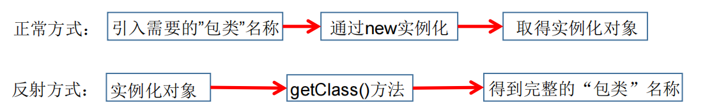

```Java
package com.qf.a_homework;

class Bank {
    private double money;//钱

    public Bank(double money) {
        this.money = money;
    }

    public double getMoney() {
        return money;
    }

    public void setMoney(double money) {
        this.money = money;
    }
}
class Save implements Runnable {
    private Bank bank;

    public Save(Bank bank) {
        this.bank = bank;
    }

    @Override
    public void run() {
        while (true) {
            synchronized (bank) {
                if (bank.getMoney() < 100) {
                    bank.setMoney(bank.getMoney() + 2000);
                    System.out.println(Thread.currentThread().getName() + ":存了两千块钱,余额为:" + bank.getMoney() + "元");
                    //存完钱以后告诉取钱线程 该取钱了
                    bank.notify();
                }else {
                    //不小于100  存钱线程等待
                    try {
                        bank.wait();
                    } catch (InterruptedException e) {
                        e.printStackTrace();
                    }
                }
            }
        }
    }
}
class Draw implements Runnable {
    private Bank bank;

    public Draw(Bank bank) {
        this.bank = bank;
    }
    @Override
    public void run() {
        while (true) {
            synchronized (bank) {
                if (bank.getMoney() >= 100) {
                    //取钱
                    bank.setMoney(bank.getMoney() - 100);
                    System.out.println(Thread.currentThread().getName() + "取走了100块钱,余额还剩:" + bank.getMoney());
                    bank.notify();
                } else {
                    //等待
                    try {
                        bank.wait();
                    } catch (InterruptedException e) {
                        e.printStackTrace();
                    }
                }
            }
        }
    }
}
public class Demo1 {
    public static void main(String[] args) {
        Bank bank = new Bank(10);
        Save save = new Save(bank);
        Draw draw = new Draw(bank);
        new Thread(save, "小明妈妈").start();
        new Thread(draw, "小明").start();
    }
}

```

```
昨天的内容
	1.死锁
	2.线程的生命周期
	3.Object类下面的三个方法
		wait
		notify
		notifyAll
	4.生产者-消费者  模型
```

今天的内容

> 1.线程池
>
> ​	ThreadPoolExecutor  7个参数需要理解其中  暂时需要理解五个参数
>
> 2.反射【重点】
>
> 
>
> 3.单例模式

### 1.反射

> 反射Reflection（反射）是被视为动态语言的关键，反射机制允许程序在执行期 借助于ReflectionAPI取得任何类的内部信息，并能直接操作任意对象的内 部属性及方法。
>
> 加载完类之后，在堆内存的方法区中就产生了一个Class类型的对象（一个类只有一个Class对象），这个对象就包含了完整的类的结构信息。我们可以通过这个对象看到类的结构。这个对象就像一面镜子，透过这个镜子看到类的结构，所以，我们形象的称之为：反射。
>
> 总结：
>
> ```
> Person.java   
> 	属性
> 	方法
> main｛
> 	Person person = new Person();
> 	person.name = "狗蛋";
> 	person.age = 12;
> ｝
> 
> 
> 反射:
> 	Person.java（有name  age  等）--->Person.class(有 name  age)---->   Class对象(name age)-->对象  person
> 	
> ```
>
> 



> Java中反射可以动态的获取类， 类属性，类方法，类构造方法等一部分的操作！！！

入门案例

```Java
package com.qf.c_reflection;

import java.lang.reflect.Constructor;
import java.lang.reflect.InvocationTargetException;

public class Demo1 {
    public static void main(String[] args) throws NoSuchMethodException, InvocationTargetException, InstantiationException, IllegalAccessException {
        //创建对象 第一种方式
        //通过无参构造方法来实例化的一个对象
        Person person1 = new Person();
        //借助于反射来创建
        //Person.class 啥玩意？  一个类会被编译成.class文件
        //Person.class这个文件中存的有咱们所有的类的信息（属性，构造方法，成员方法）
        //Person.class这个代码就是将 Person字节码文件转为了Class对象
        //getConstructor(null)啥玩意？
        //newInstance();啥玩意？
        Class<Person> personClass = Person.class;//获取Person类的字节码文件对象
        //通过Class对象 获取 构造方法对象
        Constructor<Person> constructor = personClass.getConstructor(null);
        //要构造方法干嘛？  创建对象
        //构造方法对象.newInstance();  新建实例的意思
        Person person = constructor.newInstance();
        System.out.println(person);
        /**
         * 1.获取字节码文件对象
         * 2.通过字节码文件对象获取构造方法对象
         * 3.通过构造方法对象创建对象
         */


    }
}

```

#### 1.1获取Class对象

一个类就是Class的对象

> Java可以将.java文件编译成.class文件。那么这个.class文件可以变成  Class对象
>
> .java中有属性，构造方法，成员方法-》就意味着.class文件中有原来.java中的所有
>
> 信息（属性，构造方法，成员方法）-》Class对象中有原始Java文件中的而所有信息
>
> （属性，构造方法，成员方法）
>
> 获取一个类的Class对象有三种方式:

```java 
package com.qf.b_reflect;

/**
 * description:
 * 公司:千锋教育
 * author:博哥
 * 公众号:Java架构栈
 */
public class Demo2 {
    public static void main(String[] args) throws ClassNotFoundException {
        //获取Person类的对应的  Class对象
        //第一种方式：类.class;
        Class<Person> personClass = Person.class;
        System.out.println(personClass);

        //第二种方式:  获取com.qf.b_reflect.Person  的CLass对象
        //参数是包名+ 类名
        Class<?> aClass = Class.forName("com.qf.b_reflect.Person");
        System.out.println(aClass);
        //第三种的创建方式:
        Class<? extends Person> aClass1 = new Person().getClass();
        System.out.println(aClass1);
        

    }
}

```

为啥要获取Class对象？因为这个Class包含了字节码文件中所有的信息（构造方法， 方法，属性）

可以通过Class对象来获取一个类的构造方法对象，方法对象 ，属性对象

#### 1.2获取Constructor对象【构造方法对象】

> 和类中构造方法有关系的，构造方法对象
>
> | `Constructor<?>[]` | `getConstructors()`返回包含一个数组 `Constructor`对象反射由此表示的类的所有公共构造 `类`对象。 |
> | ------------------ | ------------------------------------------------------------ |
> | `Constructor<?>[]` | `getDeclaredConstructors()`返回一个反映 `Constructor`对象表示的类声明的所有 `Constructor`对象的数组 `类` 。 |
> | `Constructor<T>`   | `getConstructor(Class<?>... parameterTypes)`返回一个 `Constructor`对象，该对象反映 `Constructor`对象表示的类的指定的公共 的构造方法。 |
> | `Constructor<T>`   | `getDeclaredConstructor(类<?>... parameterTypes)`返回一个 `Constructor`对象，该对象反映 `Constructor`对象表示的类或接口的指定 `类`函数。 |

以上的四个方法是拿谁调用的？Class对象调用的   Class对象就是字节码文件，字节码文件中有构造方法

所以只能使用Class对象来获取 构造方法对象

> 构造方法对象有啥用? 靠这个对象实例化对象
>
> 下面这个方法是使用构造方法对象调用的
>
> | `T`  | `newInstance(Object... initargs)`使用此 `Constructor`对象表示的构造函数，使用指定的初始化参数来创建和初始化构造函数的声明类的新实例。  通过构造方法创建对象 |
> | ---- | ------------------------------------------------------------ |
> |      |                                                              |

```Java
package com.qf.c_reflection;

import java.lang.reflect.Constructor;
import java.lang.reflect.InvocationTargetException;

public class Demo3 {
    public static void main(String[] args) throws NoSuchMethodException, InvocationTargetException, InstantiationException, IllegalAccessException {
        //我想要获取构造方法对象
        //1.先获取Class对象？为啥要先获取class对象？
        //Class是字节码文件对象，字节码文件才有构造方法啊
        Class<Person> personClass = Person.class;
        //getConstructors() 获取类下面所有的公开的构造方法的
        Constructor<?>[] constructors = personClass.getConstructors();
        //碰到数组  遍历
        for (Constructor<?> constructor : constructors) {
            System.out.println(constructor);
        }
        System.out.println("==============");
        //getDeclaredConstructors() 获取所有的构造方法对象
        Constructor<?>[] declaredConstructors = personClass.getDeclaredConstructors();
        for (Constructor<?> declaredConstructor : declaredConstructors) {
            System.out.println(declaredConstructor);
        }
        System.out.println("==========");
        //以上获取多个的构造方法，能不能获取一个构造方法？
        //获取无参构造方法对象
        Constructor<Person> constructor = personClass.getConstructor(null);
        System.out.println(constructor);

        //获取有参构造方法   public Person (String name, int age)
        Constructor<Person> constructor1 = personClass.getConstructor(String.class, int.class);
        System.out.println(constructor1);
        //获取 Person(String name)  默认的构造方法
//        Constructor<Person> constructor2 = personClass.getConstructor(String.class);
//        System.out.println(constructor2);
        Constructor<Person> declaredConstructor = personClass.getDeclaredConstructor(String.class);
        System.out.println(declaredConstructor);

        //通过无参构造方法对象，创建一个对象
        Person person = constructor.newInstance();
        System.out.println(person);

        //通过有参构造对象  创建对象
        Person person1 = constructor1.newInstance("狗蛋", 67);
        System.out.println(person1);

    }
}

```

一个类（Class对象）下面有构造方法（Constructor），有方法(Method)， 有属性

总结:

```
通过反射获取一个类的对象:
	1.获取这个类的Class对象
	2.通过Class对象获取这个类构造方法对象 getConstructor(Class ... parameterType)
	3.通过构造方法对象 调用newInstance方法实例化出来对象
```

```java 
package com.qf.b_reflect;

import java.lang.reflect.InvocationTargetException;

/**
 * description:
 * 公司:千锋教育
 * author:博哥
 * 
 * 公众号:Java架构栈
 */
public class Demo4 {
    public static void main(String[] args) throws NoSuchMethodException, InvocationTargetException, InstantiationException, IllegalAccessException {
        Person person = Person.class.getConstructor(null).newInstance(null);
        
    }
}

```


#### 1.3获取Method方法对象【类中方法】

> 反射将类中的方法封装成了一个对象  Method method
>
> getMethods 这个方法是通过谁调用出来的？Class的对象
>
> | Method[] | `getMethods()`返回包含一个数组 `方法`对象反射由此表示的类或接口的所有公共方法 `类`对象，包括那些由类或接口和那些从超类和超接口继承的声明。 |
> | -------- | ------------------------------------------------------------ |
> | Method   | getMethod(String name,Class ...parameterType)；              |

```Java
package com.qf.c_reflection;

import java.lang.reflect.InvocationTargetException;
import java.lang.reflect.Method;

public class Demo5 {
    public static void main(String[] args) throws NoSuchMethodException, InvocationTargetException, IllegalAccessException, InstantiationException {
        Class<Person> personClass = Person.class;
        //获取所有的方法，公开的方法，父类的公开的方法也会获取
        Method[] methods = personClass.getMethods();
        for (Method method : methods) {
            System.out.println(method);
        }
        System.out.println("=========");
        Method[] declaredMethods = personClass.getDeclaredMethods();
        for (Method declaredMethod : declaredMethods) {
            System.out.println(declaredMethod);
        }
        System.out.println("========");
        //以上获取的都是所有的方法
        //能不能获取一个方法？
        //name - 方法的名称
        //parameterTypes - 参数列表  上面方法有没有参数  指定参数类型
        // public void eat ()
        Method eat = personClass.getMethod("eat", null);
        System.out.println(eat);
        // public void eat (String name)
        Method eat1 = personClass.getMethod("eat", String.class);

        //获取私有的sleep方法
//        Method sleep = personClass.getMethod("sleep", null);
//        System.out.println(sleep);
        //咋办？加Declared
        Method sleep = personClass.getDeclaredMethod("sleep", null);
        System.out.println(sleep);
        //象想调用Person下面的方法
        //obj - 第一个参数你得告诉我方法在哪个对象下面
        //args - 用于方法调用的参数  方法的参数
        Person person = Person.class.getConstructor(null).newInstance();

        eat.invoke(person, null);
        eat1.invoke(person, "旺财");
        //现在不要管那么多，知道有这种操作！！！你要成为一个架构师，反射必须学的相当好！！！
    }
}

```

```Java
package com.qfedu.a_reflection;

import java.lang.reflect.Constructor;
import java.lang.reflect.InvocationTargetException;
import java.lang.reflect.Method;

public class Demo3 {
    public static void main(String[] args) throws NoSuchMethodException, InvocationTargetException, InstantiationException, IllegalAccessException {
        Class<Person> personClass = Person.class;
        //获取Person类中所有的公开的方法，包含父类的公开的方法
        Method[] methods = personClass.getMethods();
        //获取Person类中所有的方法，不包含父类的方法
        Method[] declaredMethods = personClass.getDeclaredMethods();
        //getMethod(String name, Class<?>... parameterTypes)
        //获取公开的方法对象
        // name  方法的名字
        //Class<?>... parameterTypes   方法的参数的数据类型 Class对象
        //public void eat () {
        Method eat = personClass.getMethod("eat", null);
        // public void eat (String name) {
        Method eat1 = personClass.getMethod("eat", String.class);
        // public void eat (String name, char sex) {
        Method eat2 = personClass.getMethod("eat", String.class, char.class);
        // private void sleep () {
//        Method sleep = personClass.getMethod("sleep", null);
//        System.out.println(sleep);
        //获取私有的方法对象
        Method sleep = personClass.getDeclaredMethod("sleep", null);
        System.out.println(sleep);
        //方法对象有了，然后能不能调用方法执行
        //public Object invoke(Object obj, Object... args)
        //第一个参数：你要告知我当前eat方法在哪个对象下面
        //第二个参数: 方法的参数的实参
        Person person = Person.class.getConstructor(null).newInstance();
        eat.invoke(person, null);
        eat1.invoke(person, "熊猫");
        eat2.invoke(person, "老邢", '男');

        //调用私有化的方法，出问题吗？
        //出问题了，权限不够咋解决？暴力反射
        sleep.setAccessible(true);//让你操作sleep方法
        sleep.invoke(person, null);

        //获取私有的构造方法对象
        //private Person (String name){
        Constructor<Person> declaredConstructor = personClass.getDeclaredConstructor(String.class);
        //能不能通过私有的构造方法创建对象？不能
        //私有化的构造方法是不能实例化的话
        //Person person3 = new Person("嘻嘻");
        declaredConstructor.setAccessible(true);
        Person xixi = declaredConstructor.newInstance("xixi");
        System.out.println(xixi);


    }
}

```

#### 1.4获取Field对象【属性对象】【作业】

```Java
package com.qfedu.a_reflection;

import java.lang.reflect.Field;
import java.lang.reflect.InvocationTargetException;

public class Demo4 {
    public static void main(String[] args) throws NoSuchFieldException, NoSuchMethodException, InvocationTargetException, InstantiationException, IllegalAccessException {
        //第一步获取Class对象为啥？因为属性在字节码文件中，字节码文件变成字节码文件对象即Class对象
        Class<Person> personClass = Person.class;
        //获取所有属性,公开的属性
        Field[] fields = personClass.getFields();
        for (Field field : fields) {
            System.out.println(field);
        }
        //
        System.out.println("========");
        //获取所有的属性对象
        Field[] declaredFields = personClass.getDeclaredFields();
        for (Field declaredField : declaredFields) {
            System.out.println(declaredField);
        }

        System.out.println("======");
        //获取某一个具体的属性对象
        //获取公开的属性的
        //getField(String name)  参数  是属性的名字
        Field sex = personClass.getField("sex");
        System.out.println(sex);
        //因为getFiled获取的是公开的属性
//        Field name = personClass.getField("name");
//        System.out.println(name);
        Field name = personClass.getDeclaredField("name");
        System.out.println(name);

        //属性对象获取出来以后，对属性进行赋值！！！
        //public void set(Object obj, Object value)
        //第一个参数：类对象，你得告诉我这个属性是谁下面的
        //第二个参数：  对属性赋的值
        Person person = personClass.getConstructor(null).newInstance();
        sex.set(person, '女');
        System.out.println(person);

        //
        name.set(person, "狗蛋");
        System.out.println(person);
        Field age = personClass.getDeclaredField("age");
        //private不能使用set进行赋值吗？并不是这样的？
        age.setAccessible(true);
        age.set(person, 23);
        System.out.println(person);
    }
}

```

### 2.单例模式

> Java提供了二十多种设计模式，全球通用的。为了更加规范化，重用化，等提供了便捷的方式
>
> 才有设计模式
>
> ​	Java开发中常用设计模式:单例模式  工厂模式  代理模式   策略模式 享元模式  适配器模式 等
>
> 单例模式：
>
> ​		要求在程序运行过程中，只出现以一个实例对象。目的减少内存的开销。
>
> 如果判断是否是同一个对象？看内存地址。如果内存地址一样，那绝对是同一个对象。
>
> 想一些问题:
>
> ​			创建对象  通过new关键字来创建。但是new一次  创建一个新的对象。再new  内存地址肯定不一样

```Java
package com.qfedu.b_single;

class Person {
    private static Person person;
    //私有化无参构造方法，在外部不能new了
    private Person () {

    }
    //一旦不能new 这咋办？但是在本类中可以new
    //弄一个方法 返回Person对象  在方法中new
    //弄成静态的方法  通过类.instance
    //静态方法中不能使用非静态的成员变量
    public static Person instance () {

        //if语句很重要！！！
        if (person == null) {
            person = new Person();
        }

        return person;
    }

}
public class Demo1 {
    public static void main(String[] args) {
//        Person person = new Person();
//        Person person1 = new Person();
//        //person 和person1  是否同一个对象？不一样的！！！
//        System.out.println(person);
//        System.out.println(person1);
        //在main主函数中不能让对象通过new出来的！！！
        Person instance = Person.instance();
        Person instance1 = Person.instance();
        Person instance2 = Person.instance();
        System.out.println(instance);
        System.out.println(instance1);
        System.out.println(instance2);

    }
}

```

单例模式分为懒汉式单例模式，饿汉式单例模式

懒汉式写法：

```Java
package com.qfedu.b_single;

import jdk.internal.org.objectweb.asm.commons.JSRInlinerAdapter;

//懒汉式写法
public class SinglePerson {
    //1.成员变量
    private static SinglePerson singlePerson;
    private SinglePerson () {

    }
    private static synchronized SinglePerson getInstance() {
        if (singlePerson == null) {
            singlePerson = new SinglePerson();
        }
        return singlePerson;
    }
}

```

饿汉式写法

```Java
package com.qfedu.b_single;

//饿汉式的写法
public class SingleDog {
    //final修饰的不能再赋值
    private static final SingleDog singleDog = new SingleDog();
    private SingleDog() {
        
    }
    public static SingleDog getInstance() {
        return singleDog;
    }
}

```

懒汉式：  线程不安全的，但是咱们加了锁，也可以保证线程安全

饿汉式：  线程安全的

效率来讲：  饿汉的效率高    因为没有锁

内存消耗:   饿汉比较消耗内存。

从综合考虑开发使用懒汉式写法！！！