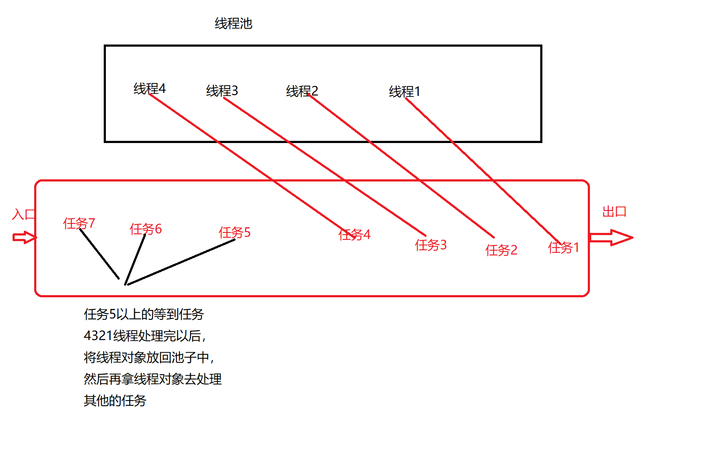

### 1.线程池【重点】

线程池一个容纳了多个线程的容器，其中的线程可以反复的使用。省去了频繁创建线程的对象的操作，无需反复创建线程而消耗更多的资源

工作原理：




这里借用《Java 并发编程的艺术》提到的来说一下**使用线程池的好处**：

**降低资源消耗**。通过重复利用已创建的线程降低线程创建和销毁造成的消耗。

**提高响应速度**。当任务到达时，任务可以不需要的等到线程创建就能立即执行。

**提高线程的可管理性**。线程是稀缺资源，如果无限制的创建，不仅会消耗系统资源，还会降低系统 的稳定性，使用线程池可以进行统一的分配，调优和监控。

线程池应用场景介绍

**应用场景介绍**

1. 网购商品秒杀
2. 云盘文件上传和下载
3. 12306网上购票系统等

**总之**
只要有并发的地方、任务数量大、每个任务执行时间长的都可以使用线程池;

> 在 Java 语言中，并发编程都是通过创建线程池来实现的，而线程池的创建方式也有很多种，每种线程池的创建方式都对应了不同的使用场景，总体来说线程池的创建可以分为以下两类：
>
> 1.通过 ThreadPoolExecutor 手动创建线程池。开发要用的
>
> 
>
> 2.通过 Executors 执行器自动创建线程池。


而以上两类创建线程池的方式，又有 7 种具体实现方法，这 7 种实现方法分别是：

1.Executors.newCachedThreadPool：创建一个可缓存的线程池，若线程数超过处理所需，缓存一段时间后会回收，若线程数不够，则新建线程。


2.Executors.newSingleThreadExecutor：创建单个线程数的线程池，它可以保证先进先出的执行顺序。


3.Executors.newScheduledThreadPool：创建一个可以执行延迟任务的线程池。


4.Executors.newSingleThreadScheduledExecutor：创建一个单线程的可以执行延迟任务的线程池。


5.Executors.newWorkStealingPool：创建一个抢占式执行的线程池（任务执行顺序不确定）【JDK 1.8 添加】。


6.ThreadPoolExecutor：手动创建线程池的方式，它创建时最多可以设置 7 个参数。


接下来我们分别来看这 7 种线程池的具体使用。

#### 1.FixedThreadPool

创建一个固定大小的线程池，可控制并发线程数。使用 FixedThreadPool 创建 2 个固定大小的线程池，具体实现代码如下：

```Java
package com.qf.b_threadpool;

import java.util.concurrent.ExecutorService;
import java.util.concurrent.Executors;

public class Demo1 {
    public static void main(String[] args) {
        fixedThreadPool();
    }
    public static void fixedThreadPool () {
        //创建固定数量的线程放到线程池里面
        //使用执行器自动创建  2是两个线程  都是两个线程
        //1.创建线程池 池子中有两个线程
        ExecutorService threadPool = Executors.newFixedThreadPool(3);
        //2.创建任务  task 使用Runnable接口创建一个任务
        //Runnable是一个接口，可以使用匿名内部类的写法
        Runnable runnable = new Runnable() {
            @Override
            public void run() {
                //执行的任务
                System.out.println("任务被执行，线程:" + Thread.currentThread().getName());
            }
        };

        //3.线程池执行任务
        //执行任务有两个方法 : submit() 和execute()
        threadPool.execute(runnable);//
        threadPool.execute(runnable);//
        threadPool.execute(runnable);//
        threadPool.execute(runnable);//

        //总结：1、创建线程池   2、创建任务  Runnable 3、拿线程池中的线程执行任务
    }
}

```

#### 2.CachedThreadPool

创建一个可缓存的线程池，若线程数超过任务所需，那么多余的线程会被缓存一段时间后才被回收，若线程数不够，则会新建线程。CachedThreadPool 使用示例如下：

```Java
package com.qf.b_threadpool;

import java.util.concurrent.ExecutorService;
import java.util.concurrent.Executors;

public class Demo2 {
    public static void main(String[] args) {
        cacheThreadPool();
    }
    public static void cacheThreadPool () {
        //1.创建线程池
        ExecutorService threadPool = Executors.newCachedThreadPool();

        //2.执行任务
        for (int i = 0; i < 10; i++) {
            // void execute(Runnable command);Runnable 接口
            //方法的参数是一个接口，有想法没？
            threadPool.execute(new Runnable() {
                @Override
                public void run() {
                    //任务

                    System.out.println("任务被执行，线程:" + Thread.currentThread().getName());
                }
            });
        }
    }
}

```

线程池创建了 10 个线程来执行相应的任务。

使用场景

CachedThreadPool 是根据短时间的任务量来决定创建的线程数量的，所以它适合短时间内有突发大量任务的处理场景。

#### 3.SingleThreadExecutor

创建单个线程的线程池，它可以保证先进先出的执行顺序。SingleThreadExecutor 使用示例如下：

```Java
package com.qf.b_threadpool;

import java.util.concurrent.ExecutorService;
import java.util.concurrent.Executors;

public class Demo3 {
    public static void main(String[] args) {
        singleThreadPool();
    }
    public static void singleThreadPool () {
        ExecutorService threadPool = Executors.newSingleThreadExecutor();
        //执行任务
        for (int i = 0; i < 10; i++) {
            int index = i;
            threadPool.execute(new Runnable() {
                @Override
                public void run() {
                    System.out.println(index + "被执行了！！！");
                }
            });
        }
    }
}

```

单个线程的线程池有什么意义？

单个线程的线程池相比于线程来说，它的优点有以下 2 个：

- 可以复用线程：即使是单个线程池，也可以复用线程。
- 提供了任务管理功能：单个线程池也拥有任务队列，在任务队列可以存储多个任务，这是线程无法实现的，并且当任务队列满了之后，可以执行拒绝策略，这些都是线程不具备的。

#### 4.ScheduledThreadPool

创建一个可以执行延迟任务的线程池。使用示例如下：

```Java
package com.qf.b_threadpool;

import java.util.Date;
import java.util.concurrent.Executors;
import java.util.concurrent.ScheduledExecutorService;
import java.util.concurrent.TimeUnit;

public class Demo4 {
    public static void main(String[] args) {
        schdulerThreadPool();
    }
    public static void schdulerThreadPool () {
        ScheduledExecutorService threadPool = Executors.newScheduledThreadPool(5);
        //添加一个定时任务执行
        System.out.println("添加任务的时间:" + new Date());

        threadPool.schedule(new Runnable() {
            @Override
            public void run() {
                System.out.println("任务被执行:" + new Date());
            }
        }, 3, TimeUnit.SECONDS);
    }
}

```

上述结果可以看出，任务在 3秒之后被执行了，实现了延迟 3s 再执行任务

#### 5.SingleThreadScheduledExecutor

创建一个单线程的可以执行延迟任务的线程池，此线程池可以看作是 ScheduledThreadPool 的单线程池版本。它的使用示例如下：

```Java
ublic static void SingleThreadScheduledExecutor() {
    // 创建线程池
    ScheduledExecutorService threadPool = Executors.newSingleThreadScheduledExecutor();
    // 添加定时执行任务(2s 后执行)
    System.out.println("添加任务,时间:" + new Date());
    threadPool.schedule(() -> {
        System.out.println("任务被执行,时间:" + new Date());
        try {
            TimeUnit.SECONDS.sleep(1);
        } catch (InterruptedException e) {
        }
    }, 2, TimeUnit.SECONDS);
}
```

上述结果可以看出，任务在 2 秒之后被执行了

#### 6.newWorkStealingPool

创建一个抢占式执行的线程池（任务执行顺序不确定），此方法是 JDK 1.8 版本新增的，因此只有在 JDK 1.8 以上的程序中才能使用。newWorkStealingPool 使用示例如下：

```Java
package com.qfedu.c_object;

import java.util.Date;
import java.util.concurrent.ExecutorService;
import java.util.concurrent.Executors;
import java.util.concurrent.ScheduledExecutorService;
import java.util.concurrent.TimeUnit;

public class Demo3 {
    public static void main(String[] args) {
        workStealingPool();
    }

    public static void workStealingPool() {
        // 创建线程池
        ExecutorService threadPool = Executors.newWorkStealingPool();
        // 执行任务
        for (int i = 0; i < 10; i++) {
            final int index = i;
            threadPool.execute(new Runnable() {
                @Override
                public void run() {
                    System.out.println(index + " 被执行,线程名:" + Thread.currentThread().getName());
                }
            });
        }
        // 确保任务执行完成
        while (!threadPool.isTerminated()) {
        }
    }
}

```

从上述结果可以看出，任务的执行顺序是不确定的，因为它是抢占式执行的。

#### 7.ThreadPoolExecutor【以后开发要用的】

Executor //英*/*ɪɡˈzekjətə(r)*/*

**ThreadPoolExecutor 是最原始、也是最推荐的手动创建线程池的方式**，它在创建时最多提供 7 个参数可供设置。ThreadPoolExecutor 使用示例如下：

```Java
package com.qfedu.a_threadpool;

import java.util.LinkedList;
import java.util.concurrent.LinkedBlockingDeque;
import java.util.concurrent.LinkedBlockingQueue;
import java.util.concurrent.ThreadPoolExecutor;
import java.util.concurrent.TimeUnit;

public class Demo5 {
    public static void main(String[] args) {
        test();
    }
    public static void test () {
        ThreadPoolExecutor threadPoolExecutor = new ThreadPoolExecutor(5, 10, 100, TimeUnit.SECONDS, new LinkedBlockingQueue<>());
        //执行任务
        for (int i = 0; i < 21; i++) {
            int index = i;
            threadPoolExecutor.execute(new Runnable() {
                @Override
                public void run() {
                    System.out.println(index + "被执行， 线程为:" + Thread.currentThread().getName());
                    try {
                        Thread.sleep(1000);
                    } catch (InterruptedException e) {
                        e.printStackTrace();
                    }
                }
            });
            //threadPoolExecutor.shutdown();
        }
    }
}

```

```
public ThreadPoolExecutor(int corePoolSize,
                              int maximumPoolSize,
                              long keepAliveTime,
                              TimeUnit unit,
                              BlockingQueue<Runnable> workQueue,
                              ThreadFactory threadFactory,
                              RejectedExecutionHandler handler) 
```

```
ThreadPoolExecutor的创建主要参数有7个，接下来将进行一一介绍。

最大线程数(MaximumPoolSize)和核心线程数(CorePoolSize)

最大线程数(MaximumPoolSize)：线程池运行的最大线程数量，受属性CAPACITY的限制，最大为(2^29)-1(约5亿)
核心线程数(CorePoolSize)：线程池中保持最小活动数的线程数量，并且不允许超时，除非调用allowCoreThreadTimeOut方法，这个时候最小值是0。
当线程池线程数量小于核心线程数时，一个新的任务请求被提交上来时，不管其他线程是否处于空闲状态，都会新建一个线程来处理这个请求。
如果在运行的线程数数量超过核心线程数但是小于最大线程数，并且工作队列已满，将创建一个线程处理这个请求。
默认情况下，当一个任务请求时，核心线程数才会被创建和启动，但是也可以通过prestartCoreThread启动一个核心线程或者prestartAllCoreThread启动所有核心线程。

创建新的线程(ThreadFactory)

ThreadFactory用来创建线程。如果没有指定ThreadFactory的话，默认会使用Executors#defaultThreadFactory 来创建线程，并且这些线程都是在同一个ThreadGroup并且都是非守护线程状态(non-daemon status)并且拥有相同的优先级(NORM_PRIORITY)。 如果指定了ThreadFactory 可以修改ThreadGroup和线程的名称、守护状态、优先级等。
ThreadFactory如果调用newThread(Runnable r)方法返回null则创建线程失败，线程池会继续运行但可能不会执行任何任务。
线程应该拥有"modifyThread"权限，如果工作线程或者其他线程没有拥有这个权限，服务可能会降级，配置更改可能不会及时生效，关闭线程池可能保持在可能终止但未完成的状态。

存活时间(Keep-alive times)d

存活时间(Keep-alive times)：空闲线程等待工作的超时时间（以纳秒为单位）
如果当前线程池中的线程数超过了核心线程数，超出的部分线程如果空闲的时长大于存活时长，那么他们将会被终止运行。当线程池不被频繁使用的时候，这提供了一种减少资源消耗的方法。存活时间可以通过setKeepAliveTime(long, TimeUnit)进行修改，使用 setKeepAliveTime(Long.MAX_VALUE, NANOSECONDS)有效地禁止空闲线程在关闭之前终止。默认情况下，存活策略只适用于当前线程数超过核心线程数的情况下。
但是使用方法allowCoreThreadTimeOut(boolean0)也可以将这个超时策略应用到核心线程，只要keepAliveTime值不为零。

时间单位(TimeUnit)

TimeUnit 是存活时间的单位。

阻塞队列(BlockingQueue)

任何实现了BlockingQueue接口的实现类都可以用来传输和保存提交的任务，阻塞队列的使用和线程池大小相关：

如果运行的线程少于核心线程数, Executor总是倾向于添加一个新线程而不是排队

如果核心线程数或更多线程正在运行(不超过最大线程数)，Executor总是倾向于排队请求，而不是添加一个新线程
如果没有达到最大线程数并且队列未满，将创建新的线程执行任务，如果线程数大于最大线程数，任务将会被拒绝
三种排队策略

直接传递
工作队列的一个很好的默认选择是 SynchronousQueue，它将任务交给线程而不用其他方式持有它们。一个新的任务尝试排队时，如果没有可供使用的线程运行它时将会创建一个新的线程。该策略避免了锁定处理可能具有内部依赖关系的请求集，直接传递通常需要无界的最大线程池来避免新的任务提交。这反过来又承认了当命令的平均到达速度快于它们的处理速度时，线程无限增长的可能性。

无界队列
无界队列是一个没有预定义容量的队列，使用无界队列例如LinkedBlockingQueue将导致新任务一直在等待，当核心线程数的线程处于工作状态时。因此，不会有超过核心线程数的线程被创建，也就是说最大线程数是不起作用的。当任务之间互相独立，互不影响的时候这个选择可能是挺合适的。例如，在web服务器中，这种队列在消除短暂的高并发方面很有作用，它允许无界队列增长的平均速度比处理的平均速度快。

有界队列
界队列例如ArrayBlockingQueue，它能在有限的最大线程数内防止资源耗尽，但是它也更难调整和控制。
队列的大小和最大线程数可以互相替换：使用更大的队列数量和小的线程池数量能够最小化CPU的使用、系统资源和上下文切换的开销，但也人为的导致了低吞吐量。如果一个任务频繁的阻塞，例如频繁I/O，系统更多的时间是在频繁的调度而不是运行任务。使用小的队列通常需要大的线程池数量，这会让CPU更能充分利用，但是也会遇到不可接受的调度开销，也会降低吞吐量。

拒绝任务

在调用execute(Runnable)提交任务时，在Executor已经关闭或者有界队列的最大线程数和队列满的情况下任务会被拒绝。不论在什么情况下，execute方法调用RejectedExecutionHandler#rejectedExecution(Runnable, ThreadPoolExecutor)任务都会根据拒绝策略被拒绝。

四种拒绝策略

ThreadPoolExecutor预定义了四种拒绝策略：

ThreadPoolExecutor.AbortPolicy，默认的拒绝策略，简单粗暴，拒绝的时候直接抛RejectedExecutionException异常
ThreadPoolExecutor.CallerRunsPolicy，由调用者执行自身execute方法来运行提交进来的任务，从名字CallerRuns(调用者运行)中就可以看出。它会提供一个简单的反馈控制机制，这种策略将降低新任务被提交上来的速度。
ThreadPoolExecutor.DiscardPolicy，也很简单粗暴，直接丢弃任务，不抛异常。
ThreadPoolExecutor.DiscardOldestPolicy，DiscardOldest丢弃最早的任务，在队列头部也就是最新进入队列的任务会被丢弃，然后尝试提交新任务，如果提交失败会继续重复以上步骤。
也可以自己实现RejectedExecutionHandler接口，并重写rejectedExecution方法来自定义拒绝策略。

通俗解释

关于上面的参数我试着通俗的说一下，希望我说的能让你明白。
假如现在有一家软件外包公司(ThreadPoolExecutor)，公司的核心开发(corePoolSize)有5个人，公司最多容纳(maximumPoolSize)10个开发，现在公司接了5个项目，5个核心开发还忙的过来，就将这个项目给其中一个核心开发做，慢慢的销售人员接的项目越来越多，接了7个项目。5个核心开发都在做手头5个项目，公司为了节省开支新来的项目只能先接过来暂时积压(ArrayBlockingQueue)起来，但是一直积压也不是个事情，客户也会一直催，（有界队列）公司顶住最多只能积压10个，积压到10个之后公司也还能容纳5个开发，不得不再招人处理新的项目。当公司发展的越来越好，接的项目也越来越多这10个开发也忙不过来了，有新的项目再进来就只能通过各种方式拒绝(RejectedExecutionHandler)了。再后来因为疫情原因，公司能接到的项目也越来越少了，开发人员很多(Thread)已经没事儿可做了，大概过了两周时间(keepAliveTime)，公司又为了节省开支就把这些空闲下来的非核心开发给开了。当然，核心开发也不是说一定不能动也是可以开的(allowCoreThreadTimeOut(true))，只不过肯定是优先考虑非核心人员。
有人说了，项目多的时候为啥不扩大公司规模呢？
首先，公司老板最多也就有养这几个员工的的能力，养的多了老板也吃不消，多招一个人可能也不会使工作效率提高，反而可能拖累其他开发的进度，能养几个员工也是经过老板深思熟虑加以往的经验总结得出的结果。

总结：
	LinkedBlockingQueue：最大线程数是不起作用  无界队列
	3个任务-》开3个线程     任务还会放到队列中排队吗？不会的队列是0个任务
	5个任务-》开5个线程     对列中 0个
	6个任务-》开5个线程     对列中  1个  只要线程执行完5个以后，最后一个任务的话  随机从5个线程中抽取一个然后执行最后的线程
	12个任务-》开5个线程    对列中有7个
	new ArrayBlockingQueue<>(10)：有界队列  只能放10个任务  最大线程数是10
	3个任务-》开3个线程   有界对列中 有没有任务？ 没有的
	6个任务-》开5个核心线程  有界对类中存1个
	12个任务-》开5个核心线程  有界对列存7个  有界对列可以放10个
	16个任务-》开6个线程 （为啥会创建6个线程？）  有界队列存10个 已经放满了  先紧着有界队列放最大的任务数，如果核心线程还不够处理线程数的时候，最大线程开始上 
	21个任务-》RejectedExecutionException  最多会执行20个任务，第21个任务 会被拒绝！！！
	这个拒绝策略的前提是有界队列。
	
	真实开发 的时候一般使用无界队列！！！
```

**ThreadPoolExecutor 相比于其他创建线程池的优势在于，它可以通过参数来控制最大任务数和拒绝策略，让线程池的执行更加透明和可控**，所以在阿里巴巴《Java开发手册》是这样规定的：

```
【强制要求】线程池不允许使用 Executors 去创建，而是通过 ThreadPoolExecutor 的方式，这样的处理方式让写的同学更加明确线程池的运行规则，规避资源耗尽的风险。
```

```
说明：Executors 返回的线程池对象的弊端如下：

1） FixedThreadPool 和 SingleThreadPool：允许的请求队列长度为 Integer.MAX_VALUE，可能会堆积大量的请求，从而导致 OOM。

2）CachedThreadPool：允许的创建线程数量为 Integer.MAX_VALUE，可能会创建大量的线程，从而导致 OOM。
```

总结

线程池的创建方式总共有以下 7 种：

1. Executors.newFixedThreadPool：创建一个固定大小的线程池，可控制并发的线程数，超出的线程会在队列中等待。
2. Executors.newCachedThreadPool：创建一个可缓存的线程池，若线程数超过处理所需，缓存一段时间后会回收，若线程数不够，则新建线程。
3. Executors.newSingleThreadExecutor：创建单个线程数的线程池，它可以保证先进先出的执行顺序。
4. Executors.newScheduledThreadPool：创建一个可以执行延迟任务的线程池。
5. Executors.newSingleThreadScheduledExecutor：创建一个单线程的可以执行延迟任务的线程池。
6. Executors.newWorkStealingPool：创建一个抢占式执行的线程池（任务执行顺序不确定）【JDK 1.8 添加】。
7. ThreadPoolExecutor：手动创建线程池的方式，它创建时最多可以设置 7 个参数。

而**线程池的创建推荐使用最后一种 ThreadPoolExecutor 的方式来创建，因为使用它可以明确线程池的运行规则，规避资源耗尽的风险**。s

```Java
package com.qf.b_threadpool;

import java.util.concurrent.ArrayBlockingQueue;
import java.util.concurrent.ThreadPoolExecutor;
import java.util.concurrent.TimeUnit;

public class Demo6 {
    public static void main(String[] args) {
        test();
    }
    public static void test () {
        ThreadPoolExecutor threadPool = new ThreadPoolExecutor(5, 10, 100, TimeUnit.SECONDS,new ArrayBlockingQueue<>(10));
        //核心线程数  5
        //最大线程数  10
        //执行任务  3个任务，只有3个线程
        //new LinkedBlockingeque<>
        //当任务多了线程执行不过来，然后先把任务放到队列中
        //后续再执行
        Runnable runnable = new Runnable() {
            @Override
            public void run() {
                for (int i = 1; i <= 9; i++) {
                    for (int j = 1; j <= i; j++) {
                        System.out.print(j + "*" + i + "=" + j * i +"\t");
                    }
                    System.out.println();
                }
            }
        };
        Runnable runnable1 = new Runnable() {
            @Override
            public void run() {
                for (int i = 1; i <= 9; i++) {
                    for (int j = 1; j <= i; j++) {
                        System.out.print("*");
                    }
                    System.out.println();
                }
            }
        };
        threadPool.execute(runnable);
        threadPool.execute(runnable1);
    }
}

```

