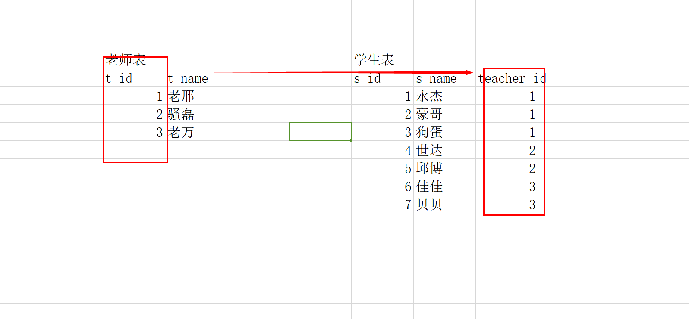
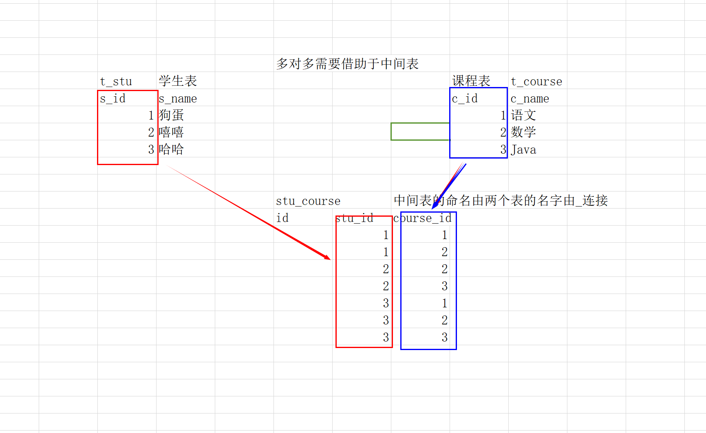
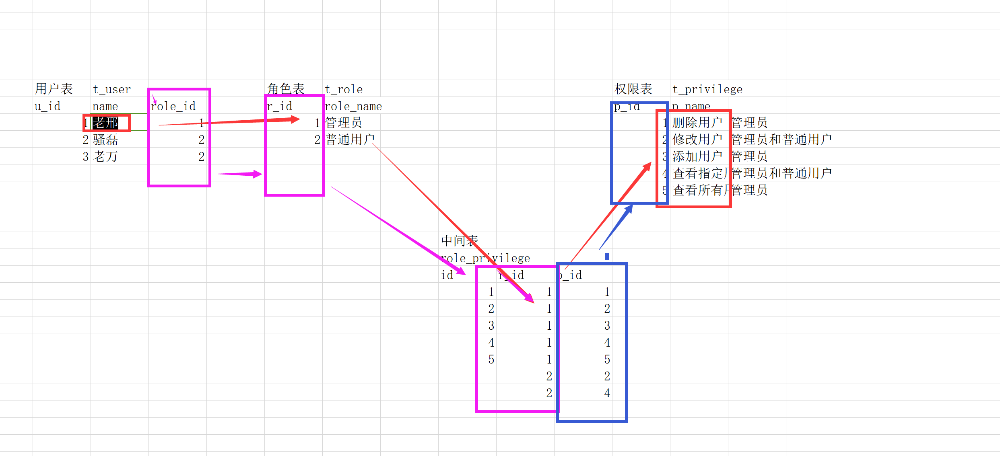

### 回顾

```
1.查询相关的关键字
	运算符
	and和or
	like
	order by
	group by ...having...
	limit 
2.内建的函数
	count(*)
	
3.数据约束问题 在创建表的对字段进行约束的
	default 默认
	not null  非空
	unique  唯一
	primary key   即非空 又唯一
	auto_increment   自增长
	
4.外键

当两张表的时候一张的字段会作为另外一张表的外键来看待的
部门表【主表】
员工表【从表】  deptId

constraint fk_emp_dept foreign key(deptId) references dept(id) on delete cascade on update cascade

```


### 1.联表查询【重点】

#### 1.0常规的联表查询

```mysql
mysql> select * from dept;
+----+-----------+
| id | deptName  |
+----+-----------+
|  3 | 教学部    |
+----+-----------+
1 row in set (0.00 sec)

mysql> select * from employee;
+----+---------+--------+---------------------+
| id | empName | deptId | regTime             |
+----+---------+--------+---------------------+
|  1 | 老邢    |      3 | 2023-06-29 16:28:09 |
|  4 | 老万    |      3 | 2023-06-29 16:28:47 |
|  5 | 骚磊    |      3 | 2023-06-29 16:28:48 |
+----+---------+--------+---------------------+
#联表查询  老邢属于哪个部门
mysql> select employee.id, employee.empName, dept.deptName  #查什么
	->from  employee,dept #从哪查   多张表使用逗号隔开
	->where  employee.deptId = dept.id and employee.empName = "老邢";#约束的条件一定要带
	
#联表查询的时候对表可以起别名
mysql> select e.id, e.empName, d.deptName
    -> from employee e, dept d
    -> where e.deptId = d.id;
+----+---------+-----------+
| id | empName | deptName  |
+----+---------+-----------+
|  1 | 老邢    | 教学部    |
|  4 | 老万    | 教学部    |
|  5 | 骚磊    | 教学部    |
+----+---------+-----------+
#联表查询的时候对字段可以起别名
mysql> select e.id as "编号", e.empName as "名字", d.deptName as "部门"
    -> from employee e, dept d
    -> where e.deptId = d.id;
+--------+--------+-----------+
| 编号   | 名字   | 部门      |
+--------+--------+-----------+
|      1 | 老邢   | 教学部    |
|      4 | 老万   | 教学部    |
|      5 | 骚磊   | 教学部    |
+--------+--------+-----------+
```

练习一个题：查找教学部所有的员工的名字

```mysql
mysql> select d.deptName, e.empName
    -> from dept d, employee e
    -> where d.id = e.deptId and d.deptName = "教学部";
+-----------+---------+
| deptName  | empName |
+-----------+---------+
| 教学部    | 老邢    |
| 教学部    | 老万    |
| 教学部    | 骚磊    |
+-----------+---------+
3 rows in set (0.00 sec)

mysql -h10.8.155.63 -ugoudan -p123
```


#### 1.1内连接和外连接

> ** join 用于根据两个或多个表中的列之间的关系，从这些表中查询数据。**

##### 1.1.1内连接

内连接 inner join的语法格式

> ```
> SELECT 字段
> FROM 表1
> INNER JOIN 表2
> ON 约束关系
> ```

```mysql
#查教学部有多少人
mysql> select * from dept;
+----+-----------+
| id | deptName  |
+----+-----------+
|  3 | 教学部    |
+----+-----------+
1 row in set (0.00 sec)

mysql> select * from employee;
+----+---------+--------+---------------------+
| id | empName | deptId | regTime             |
+----+---------+--------+---------------------+
|  1 | 老邢    |      3 | 2023-06-29 16:28:09 |
|  4 | 老万    |      3 | 2023-06-29 16:28:47 |
|  5 | 骚磊    |      3 | 2023-06-29 16:28:48 |
+----+---------+--------+---------------------+

内连接的写法
mysql> select d.deptName, e.empName
    -> from dept d
    -> inner join employee e
    -> on d.id = e.deptId;
+-----------+---------+
| deptName  | empName |
+-----------+---------+
| 教学部    | 老邢    |
| 教学部    | 老万    |
| 教学部    | 骚磊    |
+-----------+---------+
#查看老邢属于哪个部门？
mysql> select e.empName, d.deptName
    -> from employee e
    -> inner join dept d
    -> on e.deptId = d.id
    -> where e.empName = "老邢";
+---------+-----------+
| empName | deptName  |
+---------+-----------+
| 老邢    | 教学部    |
+---------+-----------+
```

联表查询

##### 1.1.2外连接【很少用】

> 左外连接
>
> LEFT JOIN 关键字会从左表 (table_name1) 那里返回所有的行，即使在右表 (table_name2) 中没有匹配的行。也要展示。

```mysql
#左外连接  右外连接
#左外连接的语法格式：select 字段 from 左表1 left outer join 右表2 on 约束条件
#左边表全部显示，右边表去匹左边表，如果没有匹配上就显示null
mysql> select d.deptName, e.empName
    -> from dept d
    -> left outer join employee e
    -> on d.id = e.deptId;
+-----------+---------+
| deptName  | empName |
+-----------+---------+
| 教学部    | 老邢    |
| 教学部    | 老万    |
| 教学部    | 骚磊    |
| 品保部    | NULL    |
+-----------+---------+
#右外连接
#语法格式：select 字段  from 左表1  right outer join 右表2 on  约束条件
#以右边表为主右边表要全部显示了，左边如果没有匹配到就显示为null
mysql> select *
    -> from employee e
    -> right outer join dept d
    -> on e.deptId = d.id;
+------+---------+--------+---------------------+----+-----------+
| id   | empName | deptId | regTime             | id | deptName  |
+------+---------+--------+---------------------+----+-----------+
|    1 | 老邢    |      1 | 2022-04-25 10:08:04 |  1 | 教学部    |
|    2 | 雪珂    |      2 | 2022-04-25 10:08:17 |  2 | 品保部    |
|    3 | 凯旗    |      3 | 2022-04-25 10:08:30 |  3 | 技术部    |
|    4 | 骚磊    |      1 | 2022-04-25 10:08:43 |  1 | 教学部    |
|    5 | 帅栋    |      1 | 2022-04-25 10:08:56 |  1 | 教学部    |
| NULL | NULL    |   NULL | NULL                |  4 | 搓澡部    |
+------+---------+--------+---------------------+----+-----------+
```

### 2.开发级别的东西

#### 2.1一对多或者多对一的查询




```mysql
#场景：老师和学生  拿咱们班来说
#一个老师对应着多个学生（一对多）     一个学生对应着咱们的一个老师（一对一）
#邱博的老师是谁？   一对一
select ts.s_name, tt.t_name
from t_student ts
INNER JOIN t_teacher tt
on ts.teacher_id = tt.t_id
where ts.s_name = "邱博"

#查询老邢所带的学生  一对多
select tt.t_name, ts.s_name
from t_teacher tt
INNER JOIN t_student ts
on tt.t_id = ts.teacher_id
where tt.t_name = "老邢"


#要求不使用内连接的写法！！！
#不适用内连接的写法
select tt.t_name, ts.s_name
from t_student ts, t_teacher tt
where ts.teacher_id = tt.t_id and tt.t_name = '老邢'
```


#### 2.2多对对的查询



```mysql
场景：
	学生和课程的关系
	学生要选课，
	一个学生对应着多个课程
	一个课程要被多个学生选择
	一个课程对应着多个学生
	这就是多对多的关系

#看所有学生选择了哪些的课程
select ts.s_name, tc.c_name
from t_stu ts
inner join stu_course sc
on ts.s_id = sc.stu_id
inner join t_course tc
on sc.course_id = tc.c_id
#查看狗蛋选择了哪些课程
select ts.s_name, tc.c_name
from t_stu ts
inner join stu_course sc
on ts.s_id = sc.stu_id
inner join t_course tc
on sc.course_id = tc.c_id
where ts.s_name = "狗蛋"

#Java被哪些学生选择了
先写课程表
select *
from t_course tc
inner join stu_course sc
on tc.c_id = sc.course_id
inner join t_stu ts
on sc.stu_id = ts.s_id
where tc.c_name = "Java"
```


总结：搞了一个中间表  现在是三表联查  两个inner join

### 3.扩展



```mysql
#找老邢的权限有哪些
select tu.name, tp.p_name
from t_user tu
inner join t_role tr
on tu.role_id = tr.r_id
inner join role_privilege rp
on tr.r_id = rp.r_id
inner join t_privilege tp
on rp.p_id = tp.p_id
where tu.name = "老邢"
```

### 4.SQL权限管理

> 可以给咱们的数据库设置权限，别人可以进行访问
>
> 项目经理必须要会这些东西
>
> 可以给咱们的数据库设置权限，别人可以进行访问
>
> 咱们真实的开发的时候，项目经理会给数据库设置权限，然后把权限给你
>
> 我 开发的时候需要用在库中用四张表，梦圆开发需要其他的6张表。这个项目经理会将权限开给我（4张表）和梦圆（6张表）
>
> 项目经理必须要会这些东西
>
> 数据库安装好以后  默认用户是root。咱们也可以创建另外的用户的！！！

```
1.创建用户
CREATE USER 用户名 [IDENTIFIED BY '密码'][,用户名 [IDENTIFIED BY '密码']];
比如
CREATE USER 'kangshifu'@'localhost' IDENTIFIED BY '123456';
用户名参数表示新建用户的账户，由 用户（User） 和 主机名（Host） 构成；

“[ ]”表示可选，也就是说，可以指定用户登录时需要密码验证，也可以不指定密码验证，这样用户

可以直接登录。不过，不指定密码的方式不安全，不推荐使用。如果指定密码值，这里需要使用

IDENTIFIED BY指定明文密码值。
mysql> create user 'ruiqiang'@'localhost' identified by "123";
Query OK, 0 rows affected (0.01 sec)

2.删除用户
方式1：使用DROP方式删除（推荐）

使用DROP USER语句来删除用户时，必须用于DROP USER权限。DROP USER语句的基本语法形式如下

DROP USER user[,user]…;
比如

mysql> drop user  'lihao'@'localhost';

3. 权限列表
MySQL到底都有哪些权限呢？

mysql> show privileges;


4.授予权限的原则

权限控制主要是出于安全因素，因此需要遵循以下几个 经验原则 ：

	1、只授予能 满足需要的最小权限 ，防止用户干坏事。比如用户只是需要查询，那就只给select权限就可 以了，不要给用户赋予update、insert或者delete权限。

	2、创建用户的时候 限制用户的登录主机 ，一般是限制成指定IP或者内网IP段。

	3、为每个用户 设置满足密码复杂度的密码 。

	4、 定期清理不需要的用户 ，回收权限或者删除用户。
5.授予权限
给用户授权的方式有 2 种，分别是通过把 角色赋予用户给用户授权 和 直接给用户授权 。用户是数据库的 使用者，我们可以通过给用户授予访问数据库中资源的权限，来控制使用者对数据库的访问，消除安全 隐患。 授权命令：

GRANT 权限1,权限2,…权限n ON 数据库名称.表名称 TO 用户名@用户地址 [IDENTIFIED BY ‘密码口令’];
比如给li4用户用本地命令行方式，授予atguigudb这个库下的所有表的插删改查的权限
GRANT SELECT,INSERT,DELETE,UPDATE ON atguigudb.* TO li4@localhost ;

比如授予通过网络方式登录的kang用户 ，对所有库所有表的全部权限，密码设为123。注意这里唯独不包
括grant的权限
#赋予，mengyuan的权限  select   查询权限 java2219.person
mysql> grant select on java2219.person  to "mengyuan"@"localhost";
Query OK, 0 rows affected (0.00 sec)


#给所有的库所有的表的所有的权限
mysql> grant all privileges on *.* to "mengyuan"@"localhost";
Query OK, 0 rows affected (0.00 sec)

mysql>  GRANT SELECT, INSERT ON day32.user TO 'lihao'@'%' IDENTIFIED BY '123';

局域网内咋登陆
 mysql -h10.8.155.5 -uruiqiang -p123
我们在开发应用的时候，经常会遇到一种需求，就是要根据用户的不同，对数据进行横向和纵向的 分组。 所谓横向的分组，就是指用户可以接触到的数据的范围，比如可以看到哪些表的数据；

所谓纵向的分组，就是指用户对接触到的数据能访问到什么程度，比如能看、能改，甚至是 删除。
6.收回权限
收回权限就是取消已经赋予用户的某些权限。收回用户不必要的权限可以在一定程度上保证系统的安全 性。MySQL中使用 REVOKE语句 取消用户的某些权限。使用REVOKE收回权限之后，用户账户的记录将从 db、host、tables_priv和columns_priv表中删除，但是用户账户记录仍然在user表中保存（删除user表中 的账户记录使用DROP USER语句）。 注意：在将用户账户从user表删除之前，应该收回相应用户的所有权限。

REVOKE 权限1,权限2,…权限n ON 数据库名称.表名称 FROM 用户名@用户地址;
比如
#收回全库全表的所有权限
REVOKE ALL PRIVILEGES ON *.* FROM joe@'%';
#收回mysql库下的所有表的插删改查权限
REVOKE SELECT,INSERT,UPDATE,DELETE ON mysql.* FROM joe@localhost;
注意： 须用户重新登录后才能生效
```


### 5.视图【了解】

见文档

### 6.SQL语言分类【归纳总结】【重点】

```
1.数据库查询语言 DQL
	就是学过的select
2.数据库定义语言 DDL
	就是咱们学过的  创建库 创建表  修改表 等
3.数据库操作语言DML
	就是学过的  insert  delete update
4.数据库事务语言 DTL
	就是咱们学过的事务
5.数据库控制语言 DCL
	就是没有讲非权限控制
```

### 7.安装可视化工具

> navicate     自己百度下载破解  自己玩（公司开发用）
>


