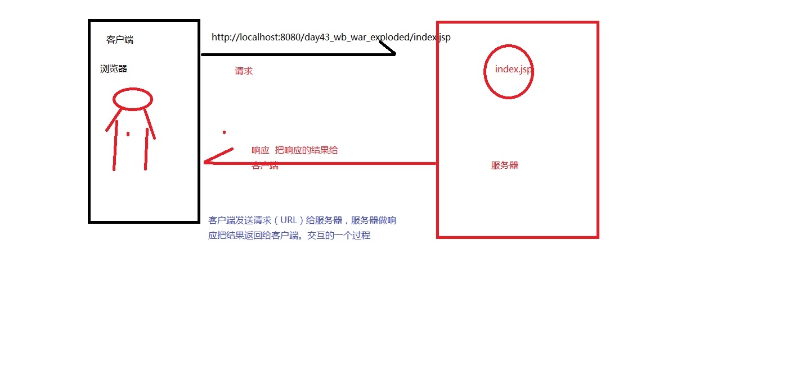
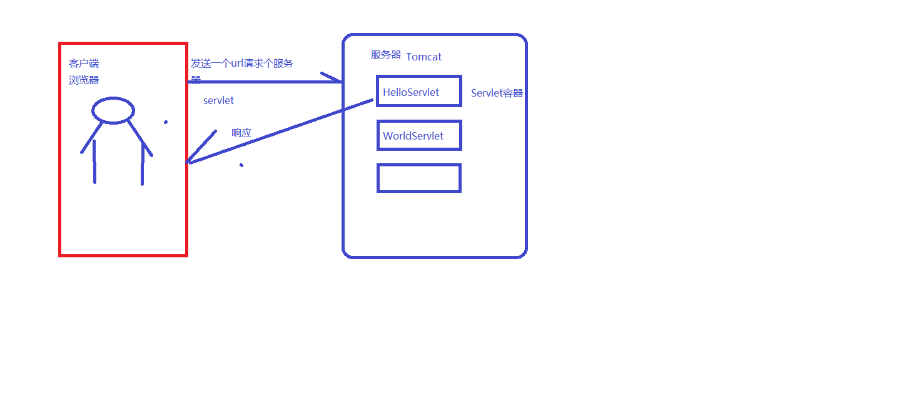

### 回顾

```
1.书写xml文件
	和html特别像
	xml可以自定义的，而且不能显示数据，用来保存数据的
2.DTD约束
	dtd约束是对xml标签进行约束写法，并不能胡乱写标签
	dtd文件是不需要咱们会的，咱们开发的时候都别人封装好的
	只需要按照dtd约束书写这个xml标签集即可
3.schema约束
	dtd约束的加强版，使用schema约束的时候可以约束咱们的数据
4.xml解析
	dom4j 开发不用，咱们看ssm框架源码的时候会用一下这个东西
	
5.安装Tomcat  
	
```

### 今天的内容

> 1.新建第一个web项目

### 1.新建第一个web项目

> 咱们之前新建的是一个java项目，不是web项目
>
> 那今天开始学习新建一个web项目，是和新建java项目完全不一样的！！！

> 新建web项目的步骤：【重要】
>
> ​	1.点击File-》new-》project-》java-》next
>
> ​		和咱们创建java项目是一样的


2.为java项目添加一个web的支持

> 1.在项目的名称上右键，选择add  framework support
>
> 2.勾选web application,version 4.0  勾选， web.xml文本勾选  点击OK即可


【重要的知识点】：

​	创建好以后项目下面会有一个web这个文件夹，web文件夹下面有一个非常重要的文件夹

叫WEB-INF

3.在web下面的WEB-INF文件夹下面新建两个文件夹【就这一步有很的同学出错，你把两个文件新建到web文件夹下面】我再次强调一定是在WEB-INF文件夹下面创建两个文件夹一个叫classes文件夹和lib文件夹

classes文件下面放的是咱们的项目的编译好的字节码文件 .class文件

lib 文件下面放的是第三方的jar包


4.重构咱们的项目

现在classes和lib文件夹只是新建了一下而已。他们压根没有起作用，对于项目来说

所以要做一个工作  重构工作

File->project structure


一定要记着点击下面的apply


架子算是搭起来了

5.咱们是一个web项目，使服务器

需要在idea里面配置Tomcat服务器


点击ok


点击运行按钮出现一个网页就，有一个叫$END$的就证明咱们创建web项目成功了！！！

现在咱们创建项目是有问题的，很大问题的，因为咱们要学习Servlet,现在创建 Servelt是有问题的

项目中使用不了HttpServlet这个类，咋解决？导报  这个jar包不用单独导，只需要导入Tomcat即可，因为Tomcat里面有Servlet-api.jar包，现在用不了，就证明咱们的Tomcat没有添加到赞咱们项目依赖里面，咋解决？


总结：

```
写个几个资源:
1.HelloServlet资源
2.index.jsp默认的
3.login.html 资源
```


### 2.web项目的执行的简单流程



以后记住就是请求和响应的过程

> http://localhost:8080/day39_wangboweb/
>
> 就是咱们新建的项目的web文件夹
>
> Tomcat除了可以包含html,css,js等这些静态资源，还可以包含动态资源 比如Servlet

### 3.在咱们的项目中新建一个Servlet资源

> Servlet属于java代码，所以要在src文件夹下面来新建

> 1.书写一个类去继承HttpServlet这个类
>
> 2.重写两个方法  doGet方法一个doPost方法
>
> 3.在servlet类的上面写了一个注解@WebServlet("路径")
>
> ​		这个注解的目的是就为通过url找到当前的这个当前的类来执行的

```java
package com.qfedu.a_servlet;

import javax.servlet.ServletException;
import javax.servlet.annotation.WebServlet;
import javax.servlet.http.HttpServlet;
import javax.servlet.http.HttpServletRequest;
import javax.servlet.http.HttpServletResponse;
import java.io.IOException;

//由于HelloServlet 是一个动态资源，需要通过url来请求
//怎么办？@WebServlet(路径)
//zhg这个路径一定是必须带/路径，如果不带就会404
@WebServlet("/hello")
//以上的注解修饰的是HelloServlet
//http://localhost:8080/day43_wb_war_exploded/hello
public class HelloServlet extends HttpServlet {
    //重写两个方法 doGet方法  doPost方法
    //由于不知道url请求方式 是get还是post
    //咱们有没有方案 不管你是get请求还是post请求我都能执行代码
    //有
    @Override
    protected void doGet(HttpServletRequest req, HttpServletResponse resp) throws ServletException, IOException {
        System.out.println("嘻嘻哒");
    }

    @Override
    protected void doPost(HttpServletRequest req, HttpServletResponse resp) throws ServletException, IOException {
        doGet(req, resp);
    }
}

```

精心给大家准备的一个错，以后报这种错就是你路径可能在其他servlet里面写过了

LifecycleException:一定是你路径有问题的

```
Caused by: org.apache.catalina.LifecycleException: Failed to start component [StandardEngine[Catalina].StandardHost[localhost].StandardContext[/day43_wb_war_exploded]]
		at org.apache.catalina.util.LifecycleBase.handleSubClassException(LifecycleBase.java:440)
		at org.apache.catalina.util.LifecycleBase.start(LifecycleBase.java:198)
		at org.apache.catalina.core.ContainerBase.addChildInternal(ContainerBase.java:717)
		... 43 more
```

10楼2教室  比喻成咱们服务器的地址  http://localhost:8080/day39_wangboweb/

10楼2教室马洋    比喻 http://localhost:8080/day39_wangboweb/mayang

10楼2教室世奇 比喻http://localhost:8080/day39_wangboweb/hashiqi

理解：

​		请求静态资源和动态资源的


创建JavaWEB工程，idea步骤

请求-响应


### 4.Servlet概念 

#### 4.1什么是servlet

> Servlet（Server Applet）是Java Servlet的简称，称为小服务程序或服务连接器，用Java编写的服务器端程序，具有独立于平台和协议的特性，主要功能在于交互式地浏览和生成数据，生成动态Web内容。
>
> 狭义的Servlet是指Java语言实现的一个接口，广义的Servlet是指任何实现了这个Servlet接口的类，一般情况下，人们将Servlet理解为后者。Servlet运行于支持Java的应用服务器中。从原理上讲，Servlet可以响应任何类型的请求，但绝大多数情况下Servlet只用来扩展基于HTTP协议的Web服务器。
>
> 最早支持Servlet标准的是JavaSoft的Java Web Server，此后，一些其它的基于Java的Web服务器开始支持标准的Servlet。

#### 4.2Servlet的入门案例

> 1.新建一个web项目工程
>
> 2.新建一个类，然后让这个类去继承HttpServlet
>
> ​		注意导入Tomcatjar包不然使用一个类HttpServlet这个类
>
> 3.重写doGet方法和doPost方法
>
> 4.一定要书写@WebServlet的注解

```java
package com.qfedu.a_servlet;

import javax.servlet.ServletException;
import javax.servlet.annotation.WebServlet;
import javax.servlet.http.HttpServlet;
import javax.servlet.http.HttpServletRequest;
import javax.servlet.http.HttpServletResponse;
import java.io.IOException;

//这个注解很重要 修饰下面的HelloServet这个类的
//"/hello"   是路径，是服务器请求当前servlet的路径
@WebServlet("/hello")
public class HelloServlet extends HttpServlet {
    //现在不知道url的请求方式是get请求还是post请求
    //所以我在post请求调用get请求，在get方法里面写输出打印代码
    @Override
    protected void doGet(HttpServletRequest req, HttpServletResponse resp) throws ServletException, IOException {
        System.out.println("this is a first servlet");
    }

    @Override
    protected void doPost(HttpServletRequest req, HttpServletResponse resp) throws ServletException, IOException {
        doGet(req, resp);
    }
}

```

有疑问？这这个servlet类到底怎么执行的呢？

用图例来解释：



通过Tomact服务器会自动创建servlet的对象，然后去调用servlet下面的方法即可

#### 4.3Servlet的三种创建方式

> 这个面试会问，但是咱们真正开发用的只有一种方式

##### 4.3.1创建Servlet的第一种方式【开发不用】

> 1.去实现一个接口 Servlet接口
>
> 接口下面有抽象方法，把抽象方法必须全部实现
>
> init方法  执行了
>
> getServletConfig方法 没有执行
>
> service方法  执行了
>
> getServltInfo方法  没有执行
>
> destroy方法 当Tomcat服务器关闭掉以后执行的
>
> Servlet接口并不是专门用于处理Http请求的。Servlet接口是定义在javax.servlet包中，HTTPServlet 使用一个 HTML 表单来发送和接收数据。要创建一个 HTTPServlet，请扩展 HttpServlet 类， 该类是用专门的方法来处理 HTML 表单的 GenericServlet 的一个子类。 HTML 表单是由 和 标记定义的。表单中典型地包含输入字段（如文本输入字段、复选框、单选按钮和选择列表）和用于提交数据的按钮。当提交信息时，它们还指定服务器应执行哪一个Servlet（或其它的程序）。 HttpServlet 类包含 init()、destroy()、service() 等方法。其中 init() 和 destroy() 方法是继承的。

```java
package com.qfedu.b_servlet;

import javax.servlet.*;
import javax.servlet.annotation.WebServlet;
import java.io.IOException;

/**
 * 创建Servlet的第一种方式
 *  去实现一个接口  Servlet
 */
@WebServlet("/TestServlet1")
public class TestServlet1 implements Servlet {
    @Override
    public void init(ServletConfig servletConfig) throws ServletException {
       //使用servletConfig对象初始化咱们Servlet对象的
        System.out.println("init方法");
    }

    @Override
    public ServletConfig getServletConfig() {
        //获取配置对象的一个方法
        //写sout的目的就是为了看一下方法执行了没
        System.out.println("getServletConfig方法");
        return null;
    }

    @Override
    public void service(ServletRequest servletRequest, ServletResponse servletResponse) throws ServletException, IOException {
        //service  核心方法，
        System.out.println("service 方法");
        //servletResponse 响应对象去写入到浏览器，展示在浏览器上面
        servletResponse.getWriter().append("servicecxixida");
    }

    @Override
    public String getServletInfo() {
        //获取servlet详细信息的方法
        System.out.println("getServletInfo方法");
        return null;
    }

    @Override
    public void destroy() {
        //销毁servlet方法的
        System.out.println("destroy方法");
        //当Tomcat服务器关闭掉以后执行的销毁方法

    }
}

```


一个servlet的执行流程：

> 1.浏览器发送一个请求给Tomcat服务器，服务器接收请求解析这个请求
>
> 2.在Tomcat服务器中创建servlet的实例化对象
>
> 3.调用init方法对servlet对象进行初始化
>
> 4.调用service方法执行核心功能
>
> servletResponse.getWriter().append("servicecxixida");
>
> 以上代码就是响应给浏览器
>
> 5.输出响应给浏览器
>
> 6.调用destroy方法销毁servlet
>
> 这个流程需要大家不断的去琢磨，才能搞懂。
>
> 请求:   浏览器-》服务器    Request
>
> 响应:   服务器-》浏览器   Response

##### 4.3.2第二种创建方式

> 去继承一个抽象类 GenericServlet
>
> 思考一个问题：
>
> ​		GenericServlet 是Servlet的子类
>
> ​		在java中儿子永远比爹强，为啥？如果儿子不比爹强的话，还有必要去把儿子的类写出来吗？直接使用爹不就行了？
>
> GenericServlet 比Servlet这个接口好用，好用在哪？
>
> 在GenericServlet 里面没有必要去重写Servlet下面的非必要的方法了
>
> 只需要重写一个核心方法即可  service方法即可，代码量瞬间就会减少，避免了冗余。
>
> 如果您需要servlet下面的方法，你再重写即可
>
> 直接通过实现Servlet接口来编写一个Servlet类，就需要实现Servlet接口中定义的5种方法，为了简化Servlet的编写，在javax.servlet包中，给我们提供了一个抽象的类GenericServlet（通用servlet），它提供了除service()方法外的其他4种方法的简单实现。GenericServlet类定义了一个通用的，不依赖具体协议的Servlet

```java
package com.qfedu.b_servlet;

import javax.servlet.GenericServlet;
import javax.servlet.ServletException;
import javax.servlet.ServletRequest;
import javax.servlet.ServletResponse;
import javax.servlet.annotation.WebServlet;
import java.io.IOException;
import java.io.PrintWriter;

/**
 *
 * 我发现GenericServlet  是接口Servlet的子抽象类
 */
@WebServlet("/TestServlet2")
public class TestServlet2 extends GenericServlet {
    @Override
    public void service(ServletRequest servletRequest, ServletResponse servletResponse) throws ServletException, IOException {
        System.out.println("service 方法");
        //解决响应乱码
        servletResponse.setContentType("text/html;charset=utf-8");
        //打印输出流
        PrintWriter writer = servletResponse.getWriter();
        //在浏览器啊上面响应中文的东西，看看是否会乱码？
        writer.append("嘻嘻哒");//将xixida添加到流对象中，给浏览器
        //所有这个xixida会在浏览器上面显示出来  响应
    }
}

```

第二种创建方式开发依旧不用

##### 4.3.3第三种创建方式【二阶段要用的】

> 继承HttpServlet
>
> HttpServlet类是GenericServlet的子类，在GenericServlet抽象类的基础之上进行的扩展
>
> 由于大多数网络应用中，都是浏览器通过HTTP协议去访问服务器资源，而通常编写的Servlet也主要是应用于HTTP协议的请求和响应，为了快速开发应用于HTTP协议的Servlet，Sun公司在javax.servlet.http包中给我们提供了一个抽象的类HttpServlet，他继承自GenericServlet类，用于创建适合Web站点的HTTP Servlet。
>
> ```
> doGet   用于http请求的  get请求
> doPost  用于http请求的  post请求
> doHead
> doPut
> doDelete
> 为啥那么多的doXXX方法咱们只写doGet和doPost
> ```

```java
package com.qfedu.b_servlet;

import javax.servlet.ServletException;
import javax.servlet.annotation.WebServlet;
import javax.servlet.http.HttpServlet;
import javax.servlet.http.HttpServletRequest;
import javax.servlet.http.HttpServletResponse;
import java.io.IOException;

@WebServlet("/TestServlet3")
public class TestServlet3 extends HttpServlet {
    //重写doGet和doPost方法
    //发现 doGet和doPost也在service 方法中  最终执行还是service方法在执行
    //为啥在开发中只写doGet和doPost方法？
    //因为前端的请求组方式就只有两种，一种是get请求一种是post请求
    @Override
    protected void doGet(HttpServletRequest req, HttpServletResponse resp) throws ServletException, IOException {
        resp.setContentType("text/html;charset=utf-8");
        resp.getWriter().append("这个是我的一个页面");
    }

    @Override
    protected void doPost(HttpServletRequest req, HttpServletResponse resp) throws ServletException, IOException {
        doGet(req, resp);
    }
}

```

总结：三种创建方式咱们只用第三种，代码书写没有冗余，更加方便好理解

#### 5.servlet的注解写法和配置文件写法

> 咱们写的是注解的写法
>
> @WebServlet("/hello") 这种写法是注解的写法
>
> 注解的目的是为了找到咱们这个资源的
>
> 通过配置文件来找到咱们资源

##### 5.1配置文件的 写法【不用】

> 1.书写一一个类去继承HttpServlet
>
> 2.找到WEB-INF文件夹下面的web.xml文件
>
> ​	去写配置信息即可  写xml标签即可

```xml
<?xml version="1.0" encoding="UTF-8"?>
<web-app xmlns="http://xmlns.jcp.org/xml/ns/javaee"
         xmlns:xsi="http://www.w3.org/2001/XMLSchema-instance"
         xsi:schemaLocation="http://xmlns.jcp.org/xml/ns/javaee http://xmlns.jcp.org/xml/ns/javaee/web-app_4_0.xsd"
         version="4.0">

<!--    servlet的配置文件写法-->
    <servlet>
<!--    servlet-name的名字一定要和servlet-mapping标签名字保持一致    -->
        <servlet-name>sb</servlet-name>
<!--        servlet-class  是servlet的类-->
        <servlet-class>com.qfedu.c_servlet.XMLServlet</servlet-class>
    </servlet>
    <servlet-mapping>
        <servlet-name>sb</servlet-name>
<!--   url-pattern  是映射的路径     -->
<!--        通过/xmlservlet这个路径来找到com.qfedu.c_servlet.XMLServlet 资源-->
        <url-pattern>/xmlservlet</url-pattern>
        <url-pattern>/xml.do</url-pattern>
        <url-pattern>/xml.action</url-pattern>
<!--        多个url-pattern  什么意思？就是可以使用url-pattern任意的路径来访问咱们的额资源-->
    </servlet-mapping>
</web-app>
```

```java
package com.qfedu.c_servlet;

import javax.servlet.ServletException;
import javax.servlet.http.HttpServlet;
import javax.servlet.http.HttpServletRequest;
import javax.servlet.http.HttpServletResponse;
import java.io.IOException;
//这个地方不要再写注解了，开始使用配置文件的写法 定义咱们的资源
public class XMLServlet extends HttpServlet {
    @Override
    protected void doGet(HttpServletRequest req, HttpServletResponse resp) throws ServletException, IOException {
        System.out.println("嘻嘻哒");

    }

    @Override
    protected void doPost(HttpServletRequest req, HttpServletResponse resp) throws ServletException, IOException {
        doGet(req, resp);
    }
}

```

配置文件写法以后不用，目的也是为了找到当前Servlet资源的

servelt3.0以下的版本才使用配置文件写法，Servlet3.0以上的版本就可以使用注解的写法了

今天上午的东西都是基本上开发不用的！！！就是我为了让大家涨涨见识的！！！

只会一点即可：【重点】

继承httpServlet  ,重写doGet和doPost方法，然后再写注解路径，通过这个路径能找到servlet资源即可

回顾上午的内容

```
1.一定得知道你创建了一个servlet资源，如何请求-》响应
	1.浏览器发送一个请求给Tomcat服务器
	2.Tomcat服务器会解析这个请求
	3.请求的是哪个servlet Tomcat服务器就会去实例化哪个servlet
	4.初始化当前的servlet
	5.执行servlet一个核心方法  service方法====》都在处理整个的请求
	6.把响应给Tomcat服务器，务器再发送给客户端浏览器
	7.当关闭Tomcat服务器的时候，servlet会自动销毁===》在响应
	把我两点即可：一个是请求（url）浏览器  响应（浏览器显示的内容）
2.学习了三种创建servlet方法
	1.实现一个接口Servlet接口
		重写5个方法
	2.去继承GenericServlet整个抽象类
		只需要重写一个方法即可
		service  核心方法
	3.去继承HttpServlet 
		重写两个方法 doGet  doPost
		
		代码是越写越简单！！！ 不要的方法没有再重写了，代码看着简便一些，只留下一些核心的业务方法
		终结：只能用第三种
3.servlet注解写法和配置文件的写法
	只讲了配置文件写法
		web.xml文件中书写配置  通过url来找到咱们servlet资源
```

##### 5.2注解写法【以后开发要用的】

注解写法是3.0及3.0以上的版本在使用

> @WebServlet()
>
> 你们自己感觉是用配置文件写法还是使11用注解写法？聪明一点的都是用注解写法，除非脑子还没有转过来圈
>
> @WebServlet()  暂且把它当成一个方1法，方法是有参数的.
>
> @Webservlet下面参数咱们以后不用，只需要会这样来写即可
>
> @WebServlet("/anno")即可
>
> ```
> value: 值的意思就是请求路径
> name:servlet的名字  可以随便定义
> urlPatterns:是一个String类型的数组  也是路径，可以放多个路径，任一的路径都可以
> 访问当前的资源  但是不能和value同时使用
> loadOnstartup: 值设置为1的话，即使你不请求咱们的servlet资源，Tomcat服务器
> 也会自动加载实例化servlet对象 来验证一下
> ```

```java
package com.qfedu.c_servlet;

import javax.servlet.ServletException;
import javax.servlet.annotation.WebServlet;
import javax.servlet.http.HttpServlet;
import javax.servlet.http.HttpServletRequest;
import javax.servlet.http.HttpServletResponse;
import java.io.IOException;

//要么选择配置文件写法，要么选择注解写法，两者只能选择其一
//写注解写法  yi因为是个路径 这个/一定要带
// value: 值的意思就是请求路径
//name:servlet的名字  可以随便定义
//urlPatterns:是一个String类型的数组  也是路径，可以放多个路径，任一的路径都可以
//访问当前的资源  但是不能和value同时使用
//loadOnstartup: 值设置为1的话，即使你不请求咱们的servlet资源，Tomcat服务器
//也会自动加载实例化servlet对象 来验证一下
@WebServlet(name = "AnnoServlet1",urlPatterns = {"/anno", "/anno.do","/sbss"}, loadOnStartup = 1)
public class AnnoServlet extends HttpServlet {
    //如果请求的是哪个servlet 就会实例化哪个Servet  new AnnoServlet();
    //无参构造方法 这个无参的构造方法会不会执行？会
    //写无参构造方法的目的就是为了验证一句话？咱们servlet被实例化了
    //s实例化只进行一次，第一次请求以后会发现被实力化了，第二次请求没有被实例化了
    //在Tomcat服务器中那个servlet默认的是被请求以后才开始实例化，而且只实例化一次

    public AnnoServlet() {
        System.out.println("我是AnnoServlet无参构造方法");
    }
    @Override
    protected void doGet(HttpServletRequest req, HttpServletResponse resp) throws ServletException, IOException {
        //HttpServletRequest  是请求对象  是servlet自己封装好的
        //HttpServletResponse  是响应对象  
        //这两个对象刚好对应着咱们的请求和响应
        resp.setContentType("text/html;charset=utf-8");
        resp.getWriter().append("这个是注解写法");
    }

    @Override
    protected void doPost(HttpServletRequest req, HttpServletResponse resp) throws ServletException, IOException {
        doGet(req, resp);
    }
}

```

#### 6.servlet生命周期【面试要问的】

> 1.实例化servlet
>
> ​	当用户第一次访问servlet的时候，Tomcat服务器容器会调用servlet的构造方法进行实例化
>
> ​	这个实例化只实例化一次
>
> 2.初始化servlet
>
> ​		会调用init方法，进行初始化servlet
>
> 3.调用核心方法service方法
>
> ​		调用service方法
>
> 4.调用destroy方法

```java
package com.qfedu.d_servlet;

import javax.servlet.*;
import javax.servlet.http.*;
import javax.servlet.annotation.*;
import java.io.IOException;

@WebServlet("/LifeServlet")
public class LifeServlet extends HttpServlet {
    //生命周期  1.被实例化
    public LifeServlet () {
        System.out.println("LifeServlet被实例化了");
    }
   //2.初始化servlet

    @Override
    public void init() throws ServletException {
        System.out.println("servlet 被初始化");
    }
    //3.调用service方法

    @Override
    protected void service(HttpServletRequest req, HttpServletResponse resp) throws ServletException, IOException {
        System.out.println("调用service方法");
    }
    //4.销毁

    @Override
    public void destroy() {
        System.out.println("销毁servlet");
    }
}

```

开始讲一些干货！！！【重要】

#### 7.获取前端请求的参数

> 想通一个事情：
>
> ​		写一个请求（url）-》响应（浏览器上面）
>
> 之前写的请求带数据给servlet了没？
>
> 现在写一个前端页面，把前端页面内数据给servlet，servlet接收一下，可以吗？可以的
>
> 只是将前端的数据发送给了某一个servlet了，servlet来接到前端的数据而已

```html
<!DOCTYPE html>
<html lang="en">
<head>
    <meta charset="UTF-8">
    <title>Title</title>
</head>
<body>
<!--action这个属性是将input输入框中的数据提交给某一个servlet   url-->
<!--action这个属性值，在前端里面不用带斜线-->
<!--method是提交方式-->
<!--post请求的时候servlet接受到的数据会乱码-->
<form action="LoginServlet" method="post">
    姓名:<input type="text" name="username1"><br>
    密码:<input type="password" name="pwd"><br>
    <input type="submit" value="登录">
</form>
</body>
</html>
```

```java
package com.qfedu.e_servlet;

import javax.servlet.*;
import javax.servlet.http.*;
import javax.servlet.annotation.*;
import java.io.IOException;

@WebServlet("/LoginServlet")
public class LoginServlet extends HttpServlet {
    @Override
    protected void doGet(HttpServletRequest request, HttpServletResponse response) throws ServletException, IOException {
        //如果前端请求的方式是一个post请求的时候会乱码，servlet接收到数据以后会乱码
        //咋解决？ 请求乱码 和响应乱码不一样
        //这个是请求乱码的解决方案
        request.setCharacterEncoding("utf-8");
        //System.out.println("xixida");
        //在html页面中带着请求数据到LoginServlet资源里面了
        //在LoginServlet这个资源里面可以获取前端发送的数据
        //思考用谁来获取？ 请求对象  响应对象  这两个对象使用哪个？
        //为啥用request？ Tomcat服务器会将请求的url变成 requst对象
        //http://localhost:8080/day44_boge/LoginServlet?username=德华&pwd=222222
        //前端的数据都在url里所以使用request对象获取前端给我发送过来的数据
        //getParameter(键) 这个键一定不要写错了，这个键就是input输入框中的name的值
        String username = request.getParameter("username1");
        String pwd = request.getParameter("pwd");
        System.out.println(username + ":" + pwd);
    }

    @Override
    protected void doPost(HttpServletRequest request, HttpServletResponse response) throws ServletException, IOException {
        doGet(request, response);
    }
}

```

#### 8.综合案例

类似于注册案例

前端注册页面发送数据给servlet，通过servlet将前端发送的数据保存到数据库

咋做？咱们之前封装过JdbcUtil和BaseDao，刚好借助于他们两个

> 1.先写一个前端的html页面，主要哦是传数据给servlet的
>
> 2.书写一个RegisterServlet资源，获取前端发送的数据
>
> 想办法把取到数据存到数据库，接下来咋办？
>
> 3.这个时候需要咱们之前封装号的JdbcUtil和BaseDao
>
> 借助于BaseDao这个类插入数据
>
> 4.直接黏贴复制
>
> ​		druid.properties  黏贴复制到src文件夹下面
>
> 5.新建一个utils文件夹 将JdbcUtils和BaseDao类复制过来
>
> 6.把需要的第三方jar包导进来即可
>
> 7.在真实的开发中，在servlet中不允许出现SQL语句，这咋办？

```html
<!DOCTYPE html>
<html lang="en">
<head>
    <meta charset="UTF-8">
    <title>Title</title>
</head>
<body>
<!--action这个属性是将input输入框中的数据提交给某一个servlet   url-->
<!--action这个属性值，在前端里面不用带斜线-->
<!--method是提交方式-->
<!--post请求的时候servlet接受到的数据会乱码-->
<form action="RegisterServlet" method="post">
    姓名:<input type="text" name="username"><br>
    密码:<input type="password" name="pwd"><br>
    <input type="submit" value="注册">
</form>
</body>
</html>
```

```java
package com.qfedu.f_servlet;

import com.qfedu.utils.BaseDao;

import javax.servlet.*;
import javax.servlet.http.*;
import javax.servlet.annotation.*;
import java.io.IOException;
import java.sql.SQLException;

@WebServlet( "/RegisterServlet")
public class RegisterServlet extends HttpServlet {
    @Override
    protected void doGet(HttpServletRequest request, HttpServletResponse response) throws ServletException, IOException {
        //获取前端发送的数据
        request.setCharacterEncoding("utf-8");
        response.setContentType("text/html;charset=utf-8");
        String username = request.getParameter("username");
        String pwd = request.getParameter("pwd");
        //现在咱们能获取到前端发送的数据，想办法存到数据库
       
        //在写SQL语句的时候一定要注意是否有表
       
        Object[] objs = {username, pwd};
        UserDao instance = UserDao.getInstance();
        try {
            instance.addUser(objs);
            response.getWriter().append("注册成功");
        } catch (SQLException e) {
            response.getWriter().append("注册失败");
            e.printStackTrace();
        }
    }

    @Override
    protected void doPost(HttpServletRequest request, HttpServletResponse response) throws ServletException, IOException {
        doGet(request, response);
    }
}

```

```java
package com.qfedu.f_servlet;

import com.qfedu.utils.BaseDao;

import java.sql.SQLException;

public class UserDao extends BaseDao {
    //把UserDao写成单例模式
    private static UserDao userDao;
    private UserDao () {
        
    }
    public static UserDao getInstance() {
        synchronized (UserDao.class){
            if (userDao == null) {
                userDao = new UserDao();
            }
        }
        return userDao;
    }
    public int addUser(Object[] objs) throws SQLException {
        String sql = "insert into user(username, password) values(?,?)";
        return super.update(sql, objs);
    }
}

```

总结：

```
1.务必把咱们讲的从前端发送数据到servlet然后存到数据库，这个案例务必敲会并理解！！！
```

