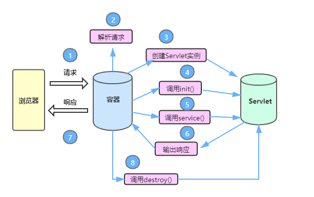

### 回顾

```
1.新建一个web工程
2.资源
	index.jsp
	login.html
	Servlet
	通过url来访问这些资源
	
3.创建Servlet
	3种
	1.实现一个接口 Servlet  重写5个方法
	2.继承GenericServlet  重写1个 service
	3.继承HttpServlet     doGet  doPost
```

### 今天的内容



一个servlet的执行流程：

> 1.浏览器发送一个请求给Tomcat服务器，服务器接收请求解析这个请求
>
> 2.在Tomcat服务器中创建servlet的实例化对象
>
> 3.调用init方法对servlet对象进行初始化
>
> 4.调用service方法执行核心功能
>
> servletResponse.getWriter().append("servicecxixida");
>
> 以上代码就是响应给浏览器
>
> 5.输出响应给浏览器
>
> 6.调用destroy方法销毁servlet
>
> 这个流程需要大家不断的去琢磨，才能搞懂。
>
> 请求:   浏览器-》服务器    Request
>
> 响应:   服务器-》浏览器   Resp


### 1.servlet的注解写法和配置文件写法

> 咱们写的是注解的写法
>
> @WebServlet("/hello") 这种写法是注解的写法
>
> 注解的目的是为了找到咱们这个资源的
>
> 还有一种写法通过配置文件来找到咱们资源

##### 1.1配置文件的 写法【不用】

> 1.书写一一个类去继承HttpServlet
>
> 2.找到WEB-INF文件夹下面的web.xml文件
>
> ​	去写配置信息即可  写xml标签即可

```xml
<?xml version="1.0" encoding="UTF-8"?>
<web-app xmlns="http://xmlns.jcp.org/xml/ns/javaee"
         xmlns:xsi="http://www.w3.org/2001/XMLSchema-instance"
         xsi:schemaLocation="http://xmlns.jcp.org/xml/ns/javaee http://xmlns.jcp.org/xml/ns/javaee/web-app_4_0.xsd"
         version="4.0">

<!--    servlet的配置文件写法-->
    <servlet>
<!--    servlet-name的名字一定要和servlet-mapping标签名字保持一致    -->
        <servlet-name>sb</servlet-name>
<!--        servlet-class  是servlet的类-->
        <servlet-class>com.qfedu.c_servlet.XMLServlet</servlet-class>
    </servlet>
    <servlet-mapping>
        <servlet-name>sb</servlet-name>
<!--   url-pattern  是映射的路径     -->
<!--        通过/xmlservlet这个路径来找到com.qfedu.c_servlet.XMLServlet 资源-->
        <url-pattern>/xmlservlet</url-pattern>
        <url-pattern>/xml.do</url-pattern>
        <url-pattern>/xml.action</url-pattern>
<!--        多个url-pattern  什么意思？就是可以使用url-pattern任意的路径来访问咱们的额资源-->
    </servlet-mapping>
</web-app>
```

```java
package com.qfedu.c_servlet;

import javax.servlet.ServletException;
import javax.servlet.http.HttpServlet;
import javax.servlet.http.HttpServletRequest;
import javax.servlet.http.HttpServletResponse;
import java.io.IOException;
//这个地方不要再写注解了，开始使用配置文件的写法 定义咱们的资源
public class XMLServlet extends HttpServlet {
    @Override
    protected void doGet(HttpServletRequest req, HttpServletResponse resp) throws ServletException, IOException {
        System.out.println("嘻嘻哒");

    }

    @Override
    protected void doPost(HttpServletRequest req, HttpServletResponse resp) throws ServletException, IOException {
        doGet(req, resp);
    }
}

```

配置文件写法以后不用，目的也是为了找到当前Servlet资源的

servelt3.0以下的版本才使用配置文件写法，Servlet3.0以上的版本就可以使用注解的写法了


##### 1.2注解写法【以后开发要用的】

注解写法是3.0及3.0以上的版本在使用

> @WebServlet()
>
> 你们自己感觉是用配置文件写法还是使11用注解写法？聪明一点的都是用注解写法，除非脑子还没有转过来圈
>
> @WebServlet()  暂且把它当成一个方1法，方法是有参数的.
>
> @Webservlet下面参数咱们以后不用，只需要会这样来写即可
>
> @WebServlet("/anno")即可
>
> ```
> value: 值的意思就是请求路径
> name:servlet的名字  可以随便定义
> urlPatterns:是一个String类型的数组  也是路径，可以放多个路径，任一的路径都可以
> 访问当前的资源  但是不能和value同时使用
> loadOnstartup: 值设置为1的话，即使你不请求咱们的servlet资源，Tomcat服务器
> 也会自动加载实例化servlet对象 来验证一下
> ```

```java
package com.qfedu.c_servlet;

import javax.servlet.ServletException;
import javax.servlet.annotation.WebServlet;
import javax.servlet.http.HttpServlet;
import javax.servlet.http.HttpServletRequest;
import javax.servlet.http.HttpServletResponse;
import java.io.IOException;

//要么选择配置文件写法，要么选择注解写法，两者只能选择其一
//写注解写法  yi因为是个路径 这个/一定要带
// value: 值的意思就是请求路径
//name:servlet的名字  可以随便定义
//urlPatterns:是一个String类型的数组  也是路径，可以放多个路径，任一的路径都可以
//访问当前的资源  但是不能和value同时使用
//loadOnstartup: 值设置为1的话，即使你不请求咱们的servlet资源，Tomcat服务器
//也会自动加载实例化servlet对象 来验证一下
@WebServlet(name = "AnnoServlet1",urlPatterns = {"/anno", "/anno.do","/sbss"}, loadOnStartup = 1)
public class AnnoServlet extends HttpServlet {
    //如果请求的是哪个servlet 就会实例化哪个Servet  new AnnoServlet();
    //无参构造方法 这个无参的构造方法会不会执行？会
    //写无参构造方法的目的就是为了验证一句话？咱们servlet被实例化了
    //s实例化只进行一次，第一次请求以后会发现被实力化了，第二次请求没有被实例化了
    //在Tomcat服务器中那个servlet默认的是被请求以后才开始实例化，而且只实例化一次

    public AnnoServlet() {
        System.out.println("我是AnnoServlet无参构造方法");
    }
    @Override
    protected void doGet(HttpServletRequest req, HttpServletResponse resp) throws ServletException, IOException {
        //HttpServletRequest  是请求对象  是servlet自己封装好的
        //HttpServletResponse  是响应对象  
        //这两个对象刚好对应着咱们的请求和响应
        resp.setContentType("text/html;charset=utf-8");
        resp.getWriter().append("这个是注解写法");
    }

    @Override
    protected void doPost(HttpServletRequest req, HttpServletResponse resp) throws ServletException, IOException {
        doGet(req, resp);
    }
}

```

### 2.servlet生命周期【面试要问的】

> 1.实例化servlet
>
> ​	当用户第一次访问servlet的时候，Tomcat服务器容器会调用servlet的构造方法进行实例化
>
> ​	这个实例化只实例化一次
>
> 2.初始化servlet
>
> ​		会调用init方法，进行初始化servlet
>
> 3.调用核心方法service方法
>
> ​		调用service方法
>
> 4.调用destroy方法

```java
package com.qfedu.d_servlet;

import javax.servlet.*;
import javax.servlet.http.*;
import javax.servlet.annotation.*;
import java.io.IOException;

@WebServlet("/LifeServlet")
public class LifeServlet extends HttpServlet {
    //生命周期  1.被实例化
    public LifeServlet () {
        System.out.println("LifeServlet被实例化了");
    }
   //2.初始化servlet

    @Override
    public void init() throws ServletException {
        System.out.println("servlet 被初始化");
    }
    //3.调用service方法

    @Override
    protected void service(HttpServletRequest req, HttpServletResponse resp) throws ServletException, IOException {
        System.out.println("调用service方法");
    }
    //4.销毁

    @Override
    public void destroy() {
        System.out.println("销毁servlet");
    }
}

```

开始讲一些干货！！！【重要】

### 3.获取前端input输入框中的请求的参数

> 想通一个事情：
>
> ​		写一个请求（url）-》响应（浏览器上面）
>
> 之前写的请求带数据给servlet了没？ 没有
>
> 现在写一个前端页面，把前端页面内数据给servlet，servlet接收一下，可以吗？可以的
>
> 案例: 只是将前端的数据发送给了某一个servlet了，servlet来接到前端的数据而已

```html
<!DOCTYPE html>
<html lang="en">
<head>
    <meta charset="UTF-8">
    <title>Title</title>
</head>
<body>
<!--action这个属性是将input输入框中的数据提交给某一个servlet   url-->
<!--action这个属性值，在前端里面不用带斜线-->
<!--method是提交方式-->
<!--post请求的时候servlet接受到的数据会乱码-->
<form action="LoginServlet" method="post">
    姓名:<input type="text" name="username1"><br>
    密码:<input type="password" name="pwd"><br>
    <input type="submit" value="登录">
</form>
</body>
</html>
```

```java
package com.qfedu.e_servlet;

import javax.servlet.*;
import javax.servlet.http.*;
import javax.servlet.annotation.*;
import java.io.IOException;

@WebServlet("/LoginServlet")
public class LoginServlet extends HttpServlet {
    @Override
    protected void doGet(HttpServletRequest request, HttpServletResponse response) throws ServletException, IOException {
        //如果前端请求的方式是一个post请求的时候会乱码，servlet接收到数据以后会乱码
        //咋解决？ 请求乱码 和响应乱码不一样
        //这个是请求乱码的解决方案
        request.setCharacterEncoding("utf-8");
        //System.out.println("xixida");
        //在html页面中带着请求数据到LoginServlet资源里面了
        //在LoginServlet这个资源里面可以获取前端发送的数据
        //思考用谁来获取？ 请求对象  响应对象  这两个对象使用哪个？
        //为啥用request？ Tomcat服务器会将请求的url变成 requst对象
        //http://localhost:8080/day44_boge/LoginServlet?username=德华&pwd=222222
        //前端的数据都在url里所以使用request对象获取前端给我发送过来的数据
        //getParameter(键) 这个键一定不要写错了，这个键就是input输入框中的name的值
        String username = request.getParameter("username1");
        String pwd = request.getParameter("pwd");
        System.out.println(username + ":" + pwd);
    }

    @Override
    protected void doPost(HttpServletRequest request, HttpServletResponse response) throws ServletException, IOException {
        doGet(request, response);
    }
}

```

### 4.综合案例

类似于注册案例

前端注册页面发送数据给servlet，通过servlet将前端发送的数据保存到数据库

咋做？咱们之前封装过JdbcUtil和BaseDao，刚好借助于他们两个

> 1.先写一个前端的html页面，主要哦是传数据给servlet的
>
> 2.书写一个RegisterServlet资源，获取前端发送的数据
>
> 想办法把取到数据存到数据库，接下来咋办？
>
> 3.这个时候需要咱们之前封装号的JdbcUtil和BaseDao
>
> 借助于BaseDao这个类插入数据
>
> 4.直接黏贴复制
>
> ​		druid.properties  黏贴复制到src文件夹下面
>
> 5.新建一个utils文件夹 将JdbcUtils和BaseDao类复制过来
>
> 6.把需要的第三方jar包导进来即可
>
> 7.在真实的开发中，在servlet中不允许出现SQL语句，这咋办？

```html
<!DOCTYPE html>
<html lang="en">
<head>
    <meta charset="UTF-8">
    <title>Title</title>
</head>
<body>
<!--action这个属性是将input输入框中的数据提交给某一个servlet   url-->
<!--action这个属性值，在前端里面不用带斜线-->
<!--method是提交方式-->
<!--post请求的时候servlet接受到的数据会乱码-->
<form action="RegisterServlet" method="post">
    姓名:<input type="text" name="username"><br>
    密码:<input type="password" name="pwd"><br>
    <input type="submit" value="注册">
</form>
</body>
</html>
```

```java
package com.qfedu.f_servlet;

import com.qfedu.utils.BaseDao;

import javax.servlet.*;
import javax.servlet.http.*;
import javax.servlet.annotation.*;
import java.io.IOException;
import java.sql.SQLException;

@WebServlet( "/RegisterServlet")
public class RegisterServlet extends HttpServlet {
    @Override
    protected void doGet(HttpServletRequest request, HttpServletResponse response) throws ServletException, IOException {
        //获取前端发送的数据
        request.setCharacterEncoding("utf-8");
        response.setContentType("text/html;charset=utf-8");
        String username = request.getParameter("username");
        String pwd = request.getParameter("pwd");
        //现在咱们能获取到前端发送的数据，想办法存到数据库
       
        //在写SQL语句的时候一定要注意是否有表
       
        Object[] objs = {username, pwd};
        UserDao instance = UserDao.getInstance();
        try {
            instance.addUser(objs);
            response.getWriter().append("注册成功");
        } catch (SQLException e) {
            response.getWriter().append("注册失败");
            e.printStackTrace();
        }
    }

    @Override
    protected void doPost(HttpServletRequest request, HttpServletResponse response) throws ServletException, IOException {
        doGet(request, response);
    }
}

```

```java
package com.qfedu.f_servlet;

import com.qfedu.utils.BaseDao;

import java.sql.SQLException;

public class UserDao extends BaseDao {
    //把UserDao写成单例模式
    private static UserDao userDao;
    private UserDao () {
        
    }
    public static UserDao getInstance() {
        synchronized (UserDao.class){
            if (userDao == null) {
                userDao = new UserDao();
            }
        }
        return userDao;
    }
    public int addUser(Object[] objs) throws SQLException {
        String sql = "insert into user(username, password) values(?,?)";
        return super.update(sql, objs);
    }
}

```

总结：

```
1.务必把咱们讲的从前端发送数据到servlet然后存到数据库，这个案例务必敲会并理解！！！
```

### 5.重定向和转发【重点！！！】

作用：在一个网页中点击一个页面可以跳转另外一个页面

##### 5.1重定向

> 用户通过浏览器发送一个请求，WEB服务器会接到这个请求，给用户发送一个302状态码。
>
> 并且设置重定向的一个路径。浏览器会发现302状态码，会自动加载到服务器设置的路径。
>
> 浏览器就会到了指定的url中
>
> 一个页面跳转到另外一个页面   
>
> 案例:  登录页面跳转到主页面
>
> 特征：【必须要记的】
>
> ​		1.重定向的过程是浏览器的行为  response(响应)
>
> ​		2.实际上浏览器做了2次请求（LoginServlet    target.html）
>
> ​		3.上一次请求request对象会丢失
>
> ​		4.重定向有一个非常明显的特征，浏览器的url发生改变了。
>
> ​		5.重定向可以是任意的网络资源

```html
<!DOCTYPE html>
<html lang="en">
<head>
    <meta charset="UTF-8">
    <title>Title</title>
</head>
<body>
<form action="LoginServlet" method="post">
  姓名:<input type="text" name="user"><br>
  密码:<input type="password" name="password"><br>
  <input type="submit" value="登录">
</form>
</body>
</html>
```

```java
package com.qfedu.a_redirect;

import javax.servlet.*;
import javax.servlet.http.*;
import javax.servlet.annotation.*;
import java.io.IOException;

@WebServlet("/LoginServlet")
public class LoginServlet extends HttpServlet {
    @Override
    protected void doGet(HttpServletRequest request, HttpServletResponse response) throws ServletException, IOException {
        doPost(request, response);
    }

    @Override
    protected void doPost(HttpServletRequest request, HttpServletResponse response) throws ServletException, IOException {
        request.setCharacterEncoding("utf-8");//post请求中文乱码的解决方案。/-
        String user = request.getParameter("user");
        String password = request.getParameter("password");
        System.out.println(user + ":" + password);
        
        //设置重定向，让其跳转到主页面 target.html
        //重定向是浏览器的行为   response下面的方法
        //当代码进入LoginServlet资源之后，就会跳转到target.html
        //重新定位到某一个资源页面
        //可以重定向到网络资源
        //response.sendRedirect("http://www.baidu.com");
        response.sendRedirect("target.html");
    }
}

```

```html
<!DOCTYPE html>
<html lang="en">
<head>
    <meta charset="UTF-8">
    <title>Title</title>
</head>
<body>
    这个是主页面
    <button onclick="window.history.back()">返回</button>
</body>
</html>
```


##### 5.2转发

> 用户使用浏览器发送请求到服务器
>
> 服务器接收当前的请求
>
> 会调用服务器内部的处理方式处理该请求
>
> 最终把响应发送给用户
>
> 请求的是一个资源，但是显示的是转发的那个资源
>
> 特征：【重点】		
>
> ​		1.转发是服务器行为
>
> ​		2.浏览器在整个过程中发送了一次请求
> ​		3.转发会带有用户HttpServletRequest这个对象
>
> ​		4.URL没有发生任何改变
>
> ​		5.转发只能是当前的项目中进行转发，不能是全网络资源

```java
package com.qfedu.b_zhuuanfa;

import javax.servlet.*;
import javax.servlet.http.*;
import javax.servlet.annotation.*;
import java.io.IOException;

@WebServlet(name = "TestServlet1", value = "/TestServlet1")
public class TestServlet1 extends HttpServlet {
    @Override
    protected void doGet(HttpServletRequest request, HttpServletResponse response) throws ServletException, IOException {
        doPost(request, response);
    }

    @Override
    protected void doPost(HttpServletRequest request, HttpServletResponse response) throws ServletException, IOException {
        System.out.println("用户请求了TestServlet1资源");
        //转发会带着数据（request）到另外一个资源中
        request.setAttribute("name", "老邢猪头肉");//request这个对象带有数据
        //带的数据  name：老邢猪头肉
        //转发是服务器的行为
        request.getRequestDispatcher("TestServlet2").forward(request, response);
        
    }
}

```

```java
package com.qfedu.b_zhuuanfa;

import javax.servlet.*;
import javax.servlet.http.*;
import javax.servlet.annotation.*;
import java.io.IOException;

@WebServlet(name = "TestServlet2", value = "/TestServlet2")
public class TestServlet2 extends HttpServlet {
    @Override
    protected void doGet(HttpServletRequest request, HttpServletResponse response) throws ServletException, IOException {
        doPost(request, response);
    }

    @Override
    protected void doPost(HttpServletRequest request, HttpServletResponse response) throws ServletException, IOException {
        //把TestServet1里面在转发到TestServlet2里面可以取出来
        Object name = request.getAttribute("name");
        //是设置响应乱码的操作
        response.setContentType("text/html;charset=utf-8");
        response.getWriter().append("这个是转发到TestServlet2里面的数据:" + name);

    }
}

```

总结:

```
1.重定向
	response.sendRedirect("重定向的资源");
2.转发 
	request.getRequestDispacher("转发的资源").forward(request, response);
```

HttpServletRequest  对象  下面很多方法。  总结下面的方法。

因为在后面才发现 就是使用 request下面的方法

### 6.URL的匹配规则【重点】

url对于咱们做服务器 开发的很重要,因为咱们要通过url来访问咱们的资源

> URL:统一资源定位符
>
> https://www.baidu.com:443/index.html?user=haoran&passwrod=123123
>
> 协议 + ip地址（域名）+端口号 + 文件资源 + 参数
>
> 用户在浏览器中申请资源
>
> http://localhost:8080/day40_wangboweb/TestServlet1
>
> 1.用户使用的协议是http协议
>
> 2.连接的主机地址是localhost
>
> 3.端口号  8080
>
> 4.申请资源 day40_wangboweb/TestServlet1
>
> ​		/day40_wangboweb是当前整个web的应用程序
>
> ​		TestServlet1这个资源
>
> 
>
> 申请资源TestServlet1的要求被Tomcat服务器捕捉,会匹配web.xml文件
>
> ​	1.先找一个叫servlet-mapping这个标签，先对其中一个子标签url-parttern进行匹配，就匹配通过
>
> ​	2.再找servlet-name就是servlet的名字，在servlet-mapping里面找
>
> ​	3.再找servlet标签,去匹配servlet-name子标签
>
> ​	4.如果名字一样的话，就证明能够匹配上。可以找到关键的servlet-calss,就是咱们资源类是一个字节码文件

```xml
<?xml version="1.0" encoding="UTF-8"?>
<web-app xmlns="http://xmlns.jcp.org/xml/ns/javaee"
         xmlns:xsi="http://www.w3.org/2001/XMLSchema-instance"
         xsi:schemaLocation="http://xmlns.jcp.org/xml/ns/javaee http://xmlns.jcp.org/xml/ns/javaee/web-app_3_1.xsd"
         version="3.1">

<!--    这个配置为了找到这个资源 servlet-->
<!--    开始配置-->
    <servlet>
<!--      servlet-namee和Servlet-mapping里面对应好  -->
        <servlet-name>WebXMLServlet</servlet-name>
<!--     servlet-class  所写的Servlet类 资源   -->
        <servlet-class>com.qfedu.b_servlet.WebXMLServlet</servlet-class>
<!--     只要Tomcat服务器被加载，就立马加载当前的servlet   -->
<!--        <load-on-startup>1</load-on-startup>-->
    </servlet>
    <servlet-mapping>

        <servlet-name>WebXMLServlet</servlet-name>
<!--      url-pattern 通过这个路径去找到上面的那个Servlet类  -->
        <url-pattern>/webxml</url-pattern>
    </servlet-mapping>
</web-app>
```


> URL匹配原则
>
> ​		1.精准匹配
>
> ​			/资源的名字
>
> ​			例如：@WebServlet("/Test1Servlet")
>
> ​		2.模糊匹配
>
> ​				*.do
>
> ​				*.action   要求以指定结尾完成匹配
>
> ​				/*		 url的后面写什么都可以匹配到这个资源

​	

```java 
package com.qfedu.c_pipei;

import javax.servlet.*;
import javax.servlet.http.*;
import javax.servlet.annotation.*;
import java.io.IOException;

//value = "*.do"  注意不带/
//在url里面随意输入  带.do的都可以访问咱们这个资源
//比如http://localhost:8080/day45_boge/sbghsaxbnasnbbnas.do
//WebServlet(name = "Test2Servlet", value = "*.do")
//http://localhost:8080/day45_boge/bhjdssnjcsjcjnsjndjnjn%E6%B5%A9%E7%84%B6%E7%8B%97%E8%9B%8B
@WebServlet(name = "Test2Servlet", value = "/*")
public class Test2Servlet extends HttpServlet {
    @Override
    protected void doGet(HttpServletRequest request, HttpServletResponse response) throws ServletException, IOException {
        doPost(request, response);
    }

    @Override
    protected void doPost(HttpServletRequest request, HttpServletResponse response) throws ServletException, IOException {
        response.setContentType("text/html;charset=utf-8");
        response.getWriter().append("我的的页面真好看");
    }
}

```

### 7.ServletContext对象【重点】

> servlet的上下文对象
>
> 是咱们当前整个应用程序的唯一可以共用的对象。是整个项目的共享区间。在整个web项目中都是可以使用这个对象的。
>
> 定义一组 servlet 用于与其 他servlet 容器通信的方式。就是可以在servlet之间共享数据，相当牛
>
> 任意的servlet 和jsp页面都是可以使用的！！！
>
> 一个servlet下面有一个当前上下文对象  设置了数据，然后再另外一个Servlet中可以通过当前上下文对象获取出来数据。实现了两个Servlet数据共享。
>
> 可以实现资源和资源之间的共享，但仅限于servlet和JSP
>
> 可以弥补多个资源间数据共享的问题。域对象。
>
> ​		1.获取ServletContext对象。通过request调用一个方法 getServletContext();

```Java
package com.qfedu.d_servletcontext;

import javax.servlet.*;
import javax.servlet.http.*;
import javax.servlet.annotation.*;
import java.io.IOException;

@WebServlet(name = "ServletContext1", value = "/ServletContext1")
public class ServletContext1 extends HttpServlet {
    @Override
    protected void doGet(HttpServletRequest request, HttpServletResponse response) throws ServletException, IOException {
        //1.获取当前上下文对象
        ServletContext servletContext = request.getServletContext();
        //2.给当前上下文对象设置值  资源和资源之间的数据共享
        servletContext.setAttribute("name", "骚磊骚里骚气");
        //当前上下文对象还有几个方法
        //获取当前项目的实际路径
        String realPath = servletContext.getRealPath("/");
        System.out.println(realPath);
        //获取服务器信息
        String serverInfo = servletContext.getServerInfo();
        System.out.println(serverInfo);
        //获取当前项目的根路径
        String contextPath = servletContext.getContextPath();
        System.out.println(contextPath);
        /*C:\Users\wangbo\IdeaProjects\day45_boge\out\artifacts\day45_boge_war_exploded\
Apache Tomcat/9.0.33
/day45_boge*/
    }

    @Override
    protected void doPost(HttpServletRequest request, HttpServletResponse response) throws ServletException, IOException {
        doGet(request, response);
    }
}

```

```Java
package com.qfedu.d_servletcontext;

import javax.servlet.*;
import javax.servlet.http.*;
import javax.servlet.annotation.*;
import java.io.IOException;

@WebServlet(name = "ServletCoontext2", value = "/ServletCoontext2")
public class ServletCzzoontext2 extends HttpServlet {
    @Override
    protected void doGet(HttpServletRequest request, HttpServletResponse response) throws ServletException, IOException {
        //1.获取当前上下文对象
        ServletContext servletContext = request.getServletContext();
        //取值
        Object name = servletContext.getAttribute("name");
        System.out.println("这个是共享的数据:" + name);
    }

    @Override
    protected void doPost(HttpServletRequest request, HttpServletResponse response) throws ServletException, IOException {
        doGet(request, response);
    }
}

```

