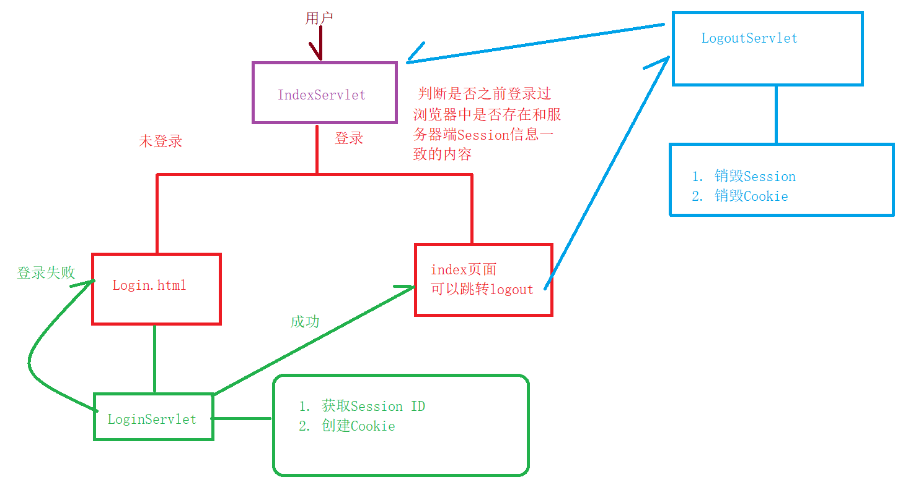

### 回顾

```
1.重定向
	response.sendRedirect("资源路径")
	在servlet里面只要写了这个代码，就会跳转到这个咱们的这个资源
	1.浏览器的行为
	2.url地址栏是变化的
	3.请求了两次
	4.不会带任何数据到重定向的页面
	
2.转发
	resuest.getRequestDispatcher("资源路径").forward(request, response)
	1.服务器行为
	2.url地址栏不会变化
	3.请求一次
	4.转发会带数据另外一个资源
3.资源的匹配规则
	资源路径问题
	1.精准匹配@WebServlet("/test")
	2.模糊匹配
		以.do或者.action为后缀的  @WebServlet("*.do")   @WebServlet("*.action")
		以/*为路径的   @WebServlet("/*")
4.ServletContext n当前上下文对象
	目的：可以实现servlet之间的数据共享的
	在servlet1里面通过ServletContext对象设置数据，在另外一个Servlet2里面可以通过Servletcontext对象获取出来
5.Request对象
	下面的方法开发必用的
	getParameter();获取前端发送的数据的
	setCharacterEncoding("utf-8");设置请求乱码的方法
6.Response对象
	和响应有关的
	
	发现一个特点：学习web网站  紧紧围绕着 请求（Request）和响应（Response）
		
```

### 今天的内容

> 1.和response相关的方法，会讲一个案例 文件下载
>
> 2.会话控制  cookie和session
>
> 3.讲一个登录案例


### 1.无状态访问

> http协议是一个无状态的访问
> 浏览器发送请求到服务器之后，服务器会给一定的响应，但是这次响应之后，下次再页面去访问其他页面时候，服务器不会自动保存前状态的
>
> 这个就是无状态访问：
>
> ​		比如登录淘宝，登录上以后，在登录状态以后，点击商品，添加购物车的时候不会保持登录状态的
>
> ​		这就是无状态的访问，但是现实开发中保持状态了没？保持了。登录淘宝以后，点击购物车无需重新登录了，阿里使用了一种技术 会话控制技术
>
> 需要使用会话技术来让无状态的效果变成有状态

### 2.会话技术

> cookie 
>
> session

#### 2.1Cookie

> java代码中设置了cookie以后，保存在浏览器中，每次访问服务器的时候，浏览器会自动把cookie带到下一个页面，下一个页面直接取cookie来用即可。
>
> 咱们用户名存到cookie中，然后下一个页面再从浏览器中取cookie即可
>
> 好比：浏览器登录了百度账号，将用户名和密码存到浏览器中，再点击百度网盘，百度网盘会从当前浏览器中取出来cookie的用户名和密码来保持登录状态
>
> 官网API:servlet通过使用HttpServletResponse.addCookie（javax.servlet.http.Cookie）方法将Cookie发送到浏览器，该方法将字段添加到http响应头中，以便一次一个地向浏览器发送Cookie。浏览器预计每个Web服务器支持20个cookie，总共支持300个cookie，并且每个cookie的大小可能限制为4 KB。
>
> cookie:
>
> ​		1.保存在浏览器中，可以通过浏览器看到
>
> ​		2.cookie的大小是有限制的  4096kb
>
> ​		3.cookie信息不能够有中文的
>
> ​		4.cookie保存形式是以键值对形式存在的
>
> 常用的API:
>
> ​		1.cookie有构造方法
>
> ​		Cookie(String name, String value)//实例化同时，对cookie信息设置值
>
> ​		2.设置cookie
>
> ​		setCookie(String value);修改cookie的值
>
> ​		setMaxAge(int time);修改cooKies的过期时间  cookie有个过期时间 超过这时间 再从浏览器中取cookie取不到的
>
> ​		3.将cookie发送给浏览器，因为是浏览器保存的cookie
>
> ​		response.addCookie(Cookie);

入门案例

设置cookie

```java
package com.qfedu.b_cookie;

import javax.servlet.*;
import javax.servlet.http.*;
import javax.servlet.annotation.*;
import java.io.IOException;

@WebServlet(name = "CookieServlet", value = "/CookieServlet")
public class CookieServlet extends HttpServlet {
    @Override
    protected void doGet(HttpServletRequest request, HttpServletResponse response) throws ServletException, IOException {
        //1.创建cookie对象 创建cookie的值同时设置 值  java204:haoran
        Cookie cookie = new Cookie("java2204", "haoran");

        //2.对cookie设置过期时间
        /*
        * setMaxAge() 方法的参数
        * 正数：表示当前cookie的有效时间  秒数
        * 负数：表示当前浏览器一关闭，cookie就会失效，如果不关闭浏览器cookie一直在的
        * 0:销毁当前的cookie        * */
        cookie.setMaxAge(60*60*24);//有效时间内是1天
        //3.直接发送给浏览器
        response.addCookie(cookie);
        //给浏览器设置cookie以后，如果我再次请求另外一个servlet资源的话，可以在另外一个
        //servlet资源里面获取当前的cookie
    }

    @Override
    protected void doPost(HttpServletRequest request, HttpServletResponse response) throws ServletException, IOException {
        doGet(request, response);
    }
}

```

获取cookie

```java
package com.qfedu.b_cookie;

import javax.servlet.*;
import javax.servlet.http.*;
import javax.servlet.annotation.*;
import java.io.IOException;

/**
 * 获取cookie的
 */
@WebServlet(name = "GetCookieServlet", value = "/GetCookieServlet")
public class GetCookieServlet extends HttpServlet {
    @Override
    protected void doGet(HttpServletRequest request, HttpServletResponse response) throws ServletException, IOException {
        //1.获取cookie对象  返回值是一个吧数组
        //JSESSIONID 是服务器默认带的
        //java2204  是咱们自己写的一个 cookie值
        //cookie:JSESSIONID=C9F0BAAB6289D25F921C196FE5AD96EB; java2204=haoran
        Cookie[] cookies = request.getCookies();
        //遍历
        for (Cookie cookie : cookies) {
            System.out.println(cookie.getName());//获取的cookie键
            System.out.println(cookie.getValue());//获取cookie值的

        }

    }

    @Override
    protected void doPost(HttpServletRequest request, HttpServletResponse response) throws ServletException, IOException {
        doGet(request, response);
    }
}

```

销毁cookie

```java
package com.qfedu.b_cookie;

import javax.servlet.*;
import javax.servlet.http.*;
import javax.servlet.annotation.*;
import java.io.IOException;

@WebServlet(name = "DestoryServlet", value = "/DestoryServlet")
public class DestoryServlet extends HttpServlet {
    @Override
    protected void doGet(HttpServletRequest request, HttpServletResponse response) throws ServletException, IOException {
        Cookie[] cookies = request.getCookies();
        for (Cookie cookie : cookies) {
            //java2204  JSESSIONID
            //直销毁java2204这个值
            if (cookie.getName().equals("java2204")) {
                cookie.setMaxAge(0);
                //重新发送给浏览器即可
                response.addCookie(cookie);
            }
        }
    }

    @Override
    protected void doPost(HttpServletRequest request, HttpServletResponse response) throws ServletException, IOException {
        doGet(request, response);
    }
}

```

思路：先设置cookie，然年再获取cookie，然后再销毁cookie，再次获取cookie

cookie咱们不用，咱们以后用session


#### 2.2Session

> 和cookie是一样的功能，都是为了保持状态的
>
> 开发中为啥不用cookie，用session呢？
>
> 1.cookie保存的数据类型比较单一的，只能保存字符串类型的数据
>
> 2.每个cookie保存的数据是大小的  4kb
>
> 3.cookie不能保存中文
>
> 综上所述开发的时候使用session，session可以解决以上的所有问题
>
> session是保存在服务器中的，不是在浏览器啊中，每一个session都会在服务器中都会有一个唯一的标识：JSESSSIONID，可以保存中文，没有大小限制的
>
> Session的API:
>
> ​		getSession();获取session对象的
>
> ​		getId();获取sessionID的，要他没啥用！！
>
> ​		invalidate();销毁session
>
> ​		setMaxinActiveIntervale();设置session的过期时间的
>
> ​		setAttribute()设置session内容的
>
> ​		getAttribute();获取session内容的

设置session

```java
package com.qfedu.c_session;

import javax.servlet.*;
import javax.servlet.http.*;
import javax.servlet.annotation.*;
import java.io.IOException;

@WebServlet(name = "SessionServlet", value = "/SessionServlet")
public class SessionServlet extends HttpServlet {
    @Override
    protected void doGet(HttpServletRequest request, HttpServletResponse response) throws ServletException, IOException {
        //1.获取Session对象
        HttpSession session = request.getSession();
        //2.获取session唯一标识 JESSIONID  这个方法可以不用记
        System.out.println(session.getId());
        //3.设置过期时间  30秒
        session.setMaxInactiveInterval(30);
        //4.设置sessiion的值，这个很重要，咱们再打开一个servleu资源
        session.setAttribute("name", "浩然");
        //以上代码最关键是第一步  和第二步
    }

    @Override
    protected void doPost(HttpServletRequest request, HttpServletResponse response) throws ServletException, IOException {
        doGet(request, response);
    }
}

```

获取session

```java
package com.qf.b_session; /**
 * description:
 * 公司:千锋教育
 * author:博哥
 * 公众号:Java架构栈
 */

import javax.servlet.*;
import javax.servlet.http.*;
import javax.servlet.annotation.*;
import java.io.IOException;

@WebServlet(name = "GetSessionServlet", value = "/GetSessionServlet")
public class GetSessionServlet extends HttpServlet {
    @Override
    protected void doGet(HttpServletRequest request, HttpServletResponse response) throws ServletException, IOException {
        //1.获取session对象
        HttpSession session = request.getSession(false);
        //2.获取session的值
        System.out.println(session);//null
        if (session != null) {
            Object username = session.getAttribute("username");
            System.out.println("这个是session对象中的值:" + username);
        }

    }

    @Override
    protected void doPost(HttpServletRequest request, HttpServletResponse response) throws ServletException, IOException {
        doGet(request, response);
    }
}

```

销毁session

```java
package com.qfedu.c_session;

import javax.servlet.*;
import javax.servlet.http.*;
import javax.servlet.annotation.*;
import java.io.IOException;

@WebServlet(name = "DestorySessionServlet", value = "/DestorySessionServlet")
public class DestorySessionServlet extends HttpServlet {
    @Override
    protected void doGet(HttpServletRequest request, HttpServletResponse response) throws ServletException, IOException {
        //1.获取session独对象
        //false  在整个项目中只出现一个session对象出来 同一个内存地址的session对象
        HttpSession session = request.getSession(false);
        //2.销毁session
        //销毁和过期时间都是一个null，所以以后写代码的时候获取session
        //先判断session是否为空的
        session.invalidate();
    }

    @Override
    protected void doPost(HttpServletRequest request, HttpServletResponse response) throws ServletException, IOException {
        doGet(request, response);
    }
}

```

先设置session ，再获取session，再销毁session，  再获取session

> 1.session要敲一下的
>
> 2.你们总结
>
> ​		HttpServletRequest：目前所用到的方法
>
> ​		HttpServletReponse：目前所用到的方法

### 3.登录入门案例

> 点击登录以后，在咱们网站的右上角有登录的名字




```java
package com.qfedu.d_login;

import javax.servlet.*;
import javax.servlet.http.*;
import javax.servlet.annotation.*;
import java.io.IOException;

@WebServlet(name = "IndexServlet", value = "/IndexServlet")
public class IndexServlet extends HttpServlet {
    @Override
    protected void doGet(HttpServletRequest request, HttpServletResponse response) throws ServletException, IOException {
       //设置响应乱码的
        response.setContentType("text/html;charset=utf-8");
        //1.获取session对象  false  如果没有获取过session对象就会是个null
        HttpSession session = request.getSession(false);
        System.out.println(session);//null
        //证明咱们已经设置过了session了
        if (session != null && session.getAttribute("user").equals("老邢")) {
            //session有，并且 session值等于了老邢字符串，才展示主页面
            String html = "<font size='7' color='red'>欢迎"+session.getAttribute("user")+"来到红浪漫洗浴中心</font>";
            String html1 = "<a href='LogoutServlet' style='color:pink;font-size:20px'>退出登录</a>";
            response.getWriter().append(html);//将字符串写到页面上面
            response.getWriter().append(html1);//将字符串写到页面上面
        } else {
            //session没有值或者session没有对上的情况，跳转到登录页面
            response.sendRedirect("login.html");
            
        }
    }

    @Override
    protected void doPost(HttpServletRequest request, HttpServletResponse response) throws ServletException, IOException {
        doGet(request, response);
    }
}

```

```html
<!DOCTYPE html>
<html lang="en">
<head>
    <meta charset="UTF-8">
    <title>Title</title>
</head>
<body>
<form action="LoginServlet" method="post">
    姓名:<input type="text" name="user"><br>
    密码:<input type="password" name="password"><br>
    <input type="submit" value="登录">
</form>
</body>
</html>
```

```java
package com.qfedu.d_login;

import javax.servlet.*;
import javax.servlet.http.*;
import javax.servlet.annotation.*;
import java.io.IOException;

@WebServlet(name = "LoginServlet", value = "/LoginServlet")
public class LoginServlet extends HttpServlet {
    @Override
    protected void doGet(HttpServletRequest request, HttpServletResponse response) throws ServletException, IOException {
        //设置请求乱码 因为是post请求
        request.setCharacterEncoding("utf-8");
        String user = request.getParameter("user");
        String password = request.getParameter("password");
        //验证信息登录
        //前端的数据会和数据库里面的数据做对比，如果数据库里面有这个数据库密码也能匹配成功
        //我就让你登录，并把用户名存到咱们的session里面  让下一个资源可以用
        //先不连数据库 明天再讲 user 是输入框中输入的
        if ("老邢".equals(user) && "250".equals(password)) {
            //如果输入框中数据和老邢和250匹配上的话
            //2.存到session里面
            HttpSession session = request.getSession();
            //3.存到session中
            session.setAttribute("user", user);
            //4.跳转得到IndexServlet
            response.sendRedirect("IndexServlet");
        } else {
            //没有匹配成功 再回到login.html
            response.sendRedirect("login.html");

        }
    }

    @Override
    protected void doPost(HttpServletRequest request, HttpServletResponse response) throws ServletException, IOException {
        doGet(request, response);
    }
}

```

```java
package com.qfedu.d_login;

import javax.servlet.*;
import javax.servlet.http.*;
import javax.servlet.annotation.*;
import java.io.IOException;

@WebServlet(name = "LogoutServlet", value = "/LogoutServlet")
public class LogoutServlet extends HttpServlet {
    @Override
    protected void doGet(HttpServletRequest request, HttpServletResponse response) throws ServletException, IOException {
        //1.获取session
        HttpSession session = request.getSession(false);
        if (session != null) {
            session.invalidate();//销毁session
            //销毁完session以后跳转到login.html  退出登录以后，跳转到咱们的登录页面
            response.sendRedirect("login.html");
        }

    }

    @Override
    protected void doPost(HttpServletRequest request, HttpServletResponse response) throws ServletException, IOException {
        doGet(request, response);
    }
}

```

### 4.综合案例

> 管理员登陆，登陆上以后显示所有人的信息（查），然后对员工进行增删改
>
> 老邢是那我们主管，他有一个网站，管理Java教学部的人员。11个人。
>
> 老邢登陆上以后，显示11个员工，对员工进行增删改
>
> 1.设计数据库
>
> ​		两张表：
>
> ​			管理员表
>
> ​			员工表
>
> 2.新建一个web工程
>
> 3.要连接数据库对数据库中操作，使用咱们封装的JdbcUtil和BaseDao 开始黏贴复制了
>
> ​		1.druid.properties
>
> ​		2.JdbcUtil和BaseDao
>
> ​		3.jar包

