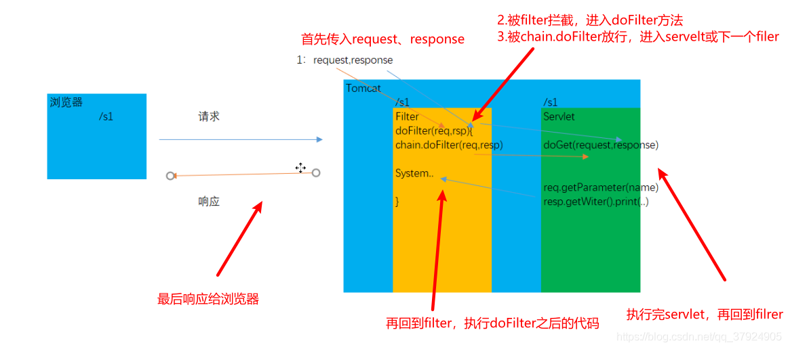

> JavaWEB有三大组件：  Servlet ， Filter(过滤器)   ，Listener监听器

### 1.Filter  过滤器

> 生活中有没有过滤器
>
> ​		空调滤芯，     渔网，  蚊帐，  净水器  
>
> Java中是有过滤器的
>
> ​	Filter也称之为过滤器，它是Servlet技术中最激动人心的技术，WEB开发人员通过Filter技术，对web服	务器管理 的所有web资源：例如Jsp, Servlet, 静态图片文件或静态html文件等进行拦截，从而实现一些	特殊的功能。
>
> ​	针对于咱们的web项目，每次启动完项目，浏览器会自动的显示 $END$   index.jsp
>
> ​	大家想一下问题，你们学员管理系统，输入网址之后，是一个登陆页面。
>
> ​	靠过滤
>
> 过滤器Filter作用场景
>
> 防止未登录就进入界面。今天要讲这个案例！！！
>
> 控制应用编码
>
> 过滤敏感词汇等场景

### 2.Filter入门案例

> 1. 编写Java类实现Fileter接口
>
> 2. 重写了doFileter方法核心的方法
>
> 3. 拦截的url
>
>    ```Java
>    @WebFilter("/*")
>    @WebFilter("/ServletTest")
>    ```

```Java
package com.qf.servlet; /**
 * description:
 * 公司:千锋教育
 * author:博哥
 * 公众号:Java架构栈
 */

import javax.servlet.*;
import javax.servlet.http.*;
import javax.servlet.annotation.*;
import java.io.IOException;

@WebServlet(name = "ServletTest", value = "/ServletTest")
public class ServletTest extends HttpServlet {
    @Override
    protected void doGet(HttpServletRequest request, HttpServletResponse response) throws ServletException, IOException {
        System.out.println("嘻嘻 我是servlet");
    }

    @Override
    protected void doPost(HttpServletRequest request, HttpServletResponse response) throws ServletException, IOException {
        doGet(request, response);
    }
}

```

```Java
package com.qf.servlet;

import javax.servlet.*;
import javax.servlet.http.*;
import javax.servlet.annotation.*;
import java.io.IOException;

@WebServlet(name = "HelloServlet", value = "/HelloServlet")
public class HelloServlet extends HttpServlet {
    @Override
    protected void doGet(HttpServletRequest request, HttpServletResponse response) throws ServletException, IOException {
        System.out.println("这个是Hello servlet");
        response.getWriter().println("hello servlet");
    }

    @Override
    protected void doPost(HttpServletRequest request, HttpServletResponse response) throws ServletException, IOException {
        doGet(request, response);
    }
}

```

### 3.过滤器的执行的流程

> 1.浏览器发送请求给服务器。在服务器中有一个过滤器   @WebFilter("路径")   先去匹配这个路径
>
> 如果这个路径匹配上，先去拦截这个资源，看看是否放行。要么拦截，要么放行）
>
> 2.是否放行  doFilter()   这个方法如果有 放行，如果没有就拦截 
>
> 请求-》过滤器-》资源（servlet， jsp， html, 图片  等）-》过滤器-》客户端
>
> ​	1.一个同学进校园，先会遇到保安，如果该同学出校园，也会碰到保安
> ​		过滤器的执行流程
> ​	2.tomcat引擎将http请求转成request（HttpServletRequest）对象，http响应转response对象
> ​		地址符合条件，则将request,resposne传给doFilter方法
> ​		再传给chain.doFilter(request,response)方法 放行的方法
> ​		再传给doGet或者doPost方法，当servlet完成三件事之后
> ​		doFilter再执行剩余代码之后，reponse再返回浏览器
> ​	




```
过滤器初始化   Tomcat服务器 在初始化 过滤器对象
[2023-05-05 02:57:25,961] Artifact day46_bobofilter:war exploded: Artifact is deployed 
放行前的代码   过滤器中的代码
嘻嘻 我是servlet   servlet 代码
放行后的代码   过滤器的代码
```


### 4.Filter生命周期

> 1.实例化Filter对象
>
> 2.初始化Filter对象
>
> 3.执行核心方法  doFilter
>
> 4.Filter会被销毁
>
> Tomcat服务器关闭  FIlter Servlet都会销毁的
>
> Filter先销毁？  Servlet先销毁？

```Java
package com.qf.filter;

import javax.servlet.*;
import javax.servlet.annotation.*;
import java.io.IOException;

@WebFilter("/HelloServlet")
public class LifeFilter implements Filter {
    //是否被实例化
    public LifeFilter () {
        System.out.println("Filter创建");
    }
    public void init(FilterConfig config) throws ServletException {
        System.out.println("Filter被初始化");
    }

    public void destroy() {
        System.out.println("销毁Filter");
    }


    @Override
    public void doFilter(ServletRequest request, ServletResponse response, FilterChain chain) throws ServletException, IOException {
        System.out.println("执行了filter核心的方法");
        chain.doFilter(request, response);
    }
}

```

### 5.过滤器的拦截路径问题

> 1.精准拦截
>
> @WebFilter("/HelloServlet")
>
> 只拦截HelloServlet资源
>
> http://localhost:8080/项目名字/HelloServlet  请求的一个资源
>
> 2.拦截一个目录
>
> @WebFilter("/el/*")
>
> 3.拦截指定的后缀的url
>
> @WebFilter("*.do")
>
> @WebFilter("*.action")
>
> 4.拦截所有的资源
>
> @WebFilter("/*")

### 6.综合案例

> 防止未登录就进入主页面。
>
> 
>
> ```Java
> package com.qf.filter; /**
>  * description:
>  * 公司:千锋教育
>  * author:博哥
>  * 公众号:Java架构栈
>  */
> 
> import com.sun.deploy.net.HttpResponse;
> 
> import javax.servlet.*;
> import javax.servlet.annotation.*;
> import javax.servlet.http.HttpServletRequest;
> import javax.servlet.http.HttpServletResponse;
> import javax.servlet.http.HttpSession;
> import java.io.IOException;
> 
> @WebFilter("/*")
> public class LoginFilter implements Filter {
> 
>     @Override
>     public void doFilter(ServletRequest request, ServletResponse response, FilterChain chain) throws ServletException, IOException {
>         /**
>          * 判断有没有session  如果有session就直接放行进入到主页面。没有session要登陆
>          */
>         //1.获取session对象
>         HttpServletRequest request1 = (HttpServletRequest) request;
>         HttpServletResponse response1 = (HttpServletResponse)response;
>         HttpSession session = request1.getSession(false);
>         System.out.println(session);//null
>         String requestURI = request1.getRequestURI();//url一部分 day41_empmanager/index.jsp
>         //http://localhost:8080/day41_empmanager/test.jsp
>         //http://localhost:8080/day41_empmanager/index.jsp
>         //http://localhost:8080/day41_empmanager/TestServlet
>         //http://localhost:8080/day41_empmanager/login.html
>         System.out.println(requestURI);
>         if (requestURI.endsWith("login.html") || requestURI.endsWith("LoginServlet")) {
>             chain.doFilter(request, response);
>         } else if (session == null || session.getAttribute("username") == null) {
>             //不能放行，跳转到登陆页面
>             response1.sendRedirect("login.html");
>         } else if (session.getAttribute("username") != null){
>             //放行
>             chain.doFilter(request, response);
>         }
> 
> 
> 
>     }
> }
> 
> ```

一定要注意：  过滤器是项目结束以后，再写，千万别一上来就写过滤器。/*  而且不放行

作业:

```

要求：
	现在有三个管理员：
		老邢   手底下有5个人  用老邢登陆 显示 老邢的手底下的5个人
		 阿伦   手底下有18个人  用 阿伦 登陆 显示  阿伦 的手底下的18个人
		 阿祥  手底下有7个人  用 阿祥  登陆 显示  阿祥  的手底下的7个人
```

